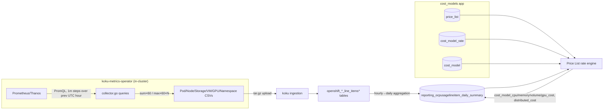

# How Each Price List Rate Is Calculated

This document traces the full path from **raw cluster metrics** (collected by the
`koku-metrics-operator`) through **koku's ingestion pipeline** to the **Price List
rate engine** that turns usage into dollars.

Sources consulted:

- `koku-metrics-operator` (`/Users/cmyers/Projects/cost_mgmt/deploying_koku/koku-metrics-operator`):
  `internal/collector/{types,queries,collector}.go`, `internal/controller/{prometheus,costmanagementmetricsconfig_controller}.go`
- `koku` (`/Users/cmyers/Projects/cost_mgmt/koku`):
  `koku/cost_models/`, `koku/api/metrics/constants.py`,
  `koku/masu/processor/ocp/ocp_cost_model_cost_updater.py`,
  `koku/masu/database/{sql,trino_sql,self_hosted_sql}/openshift/cost_model/`,
  `koku/masu/database/ocp_report_db_accessor.py`,
  `docs/architecture/cost-models.md`, `docs/architecture/price-lists/`

---

## 0. The two systems in one picture



The operator produces **usage only** — no prices. Every dollar figure in Cost
Management for OpenShift comes from multiplying that usage by a **Price List
Rate**.

---

## 1. What the operator actually reports (the raw usage side)

Source: `internal/collector/queries.go` (`QueryMap`) and `internal/collector/types.go`
(CSV schemas). Time windowing: `internal/controller/prometheus.go` and
`internal/controller/costmanagementmetricsconfig_controller.go`.

### Collection cadence

- **Cost-management reports** (pod, node, storage, namespace, VM, GPU): one row
  per entity per hour. The controller queries the **previous full UTC hour**
  (`start = now.UTC().Truncate(Hour).Add(-1h)`) with **`Step: time.Minute`**
  (~60 samples/hour). Per-series values are then folded down:
  - `Method: "sum"` → sum the per-minute samples, then `× 60` → a `*_seconds` column
    (approximates the integral over the hour)
  - `Method: "max"` → take the max sample, then `× 60 × sample_count` (≈ `× 3600`)
    → a capacity/request `*_seconds` column
- **ROS (resource-optimization) reports**: four 15-minute buckets per hour,
  instant queries at each bucket boundary — not used for cost/Price List rating.
- CSV internal query keys use hyphens (`pod-usage-cpu-core-seconds`); the final
  CSV header uses underscores (`pod_usage_cpu_core_seconds`).

### Pod/Compute usage (`podRow`, `cm-openshift-pod-usage-*.csv`)

| CSV column | PromQL (`QueryMap`) |
|---|---|
| `pod_usage_cpu_core_seconds` | `sum by (pod,namespace,node) (rate(container_cpu_usage_seconds_total{container!='',container!='POD',pod!='',namespace!='',node!=''}[5m]))` |
| `pod_request_cpu_core_seconds` | `sum by (pod,namespace,node) (kube_pod_container_resource_requests{resource='cpu'} * on(pod,namespace) group_left max by (pod,namespace) (kube_pod_status_phase{phase='Running'}))` |
| `pod_limit_cpu_core_seconds` | same pattern with `kube_pod_container_resource_limits{resource='cpu'}` |
| `pod_usage_memory_byte_seconds` | `sum by (pod,namespace,node) (container_memory_usage_bytes{container!='',container!='POD',...})` |
| `pod_request_memory_byte_seconds` / `pod_limit_memory_byte_seconds` | `kube_pod_container_resource_requests` / `_limits{resource='memory'}` |
| `pod_labels` | `kube_pod_labels{...}` (regex-captured `label_*`) |
| `node_capacity_cpu_cores`, `node_capacity_cpu_core_seconds` | `kube_node_status_capacity{resource='cpu'}` joined to `kube_node_info` |
| `node_capacity_memory_bytes`, `node_capacity_memory_byte_seconds` | `kube_node_status_capacity{resource='memory'}` joined to `kube_node_info` |
| `node_role` | `kube_node_role` |
| `resource_id` | derived from `provider_id` label |

### Storage/PVC usage (`storageRow`, `cm-openshift-storage-usage-*.csv`)

| CSV column | PromQL |
|---|---|
| `persistentvolumeclaim_capacity_bytes` / `_byte_seconds` | `kube_persistentvolume_capacity_bytes{persistentvolume != ''}` |
| `volume_request_storage_byte_seconds` | `kube_persistentvolumeclaim_resource_requests_storage_bytes * on(pvc,ns) group_left(volumename) max by(...) (kube_persistentvolumeclaim_info{volumename != ''})` |
| `persistentvolumeclaim_usage_byte_seconds` | `kubelet_volume_stats_used_bytes * on(pvc,ns) group_left(volumename) ...` |
| `storageclass`, `csi_driver`, `csi_volume_handle`, `persistentvolume_labels` | `kube_persistentvolume_labels * on(pv,ns) group_left(storageclass,csi_driver,csi_volume_handle) ...` |
| `persistentvolumeclaim_labels` | `kube_persistentvolumeclaim_labels * on(pvc,ns) group_left(volumename) ...` |

### Node labels (`nodeRow`, `cm-openshift-node-usage-*.csv`)

Only `node` + `node_labels` (from `kube_node_labels`, regex `label_*`) ship in
this CSV — capacity fields are commented out of the struct and instead joined
directly into the pod CSV. Used later for node-role classification
(master/infra/worker) and tag-based node rates.

### Namespace labels (`namespaceRow`, `cm-openshift-namespace-usage-*.csv`)

Only `namespace` + `namespace_labels` (from `kube_namespace_labels`). Metadata
for cost attribution / tagging (feeds `project_per_month`), not a billable
quantity itself.

### Virtual machines (`vmRow`, `cm-openshift-vm-usage-*.csv`, KubeVirt)

| CSV column | PromQL |
|---|---|
| `vm_uptime_total_seconds` | `kubevirt_vmi_info{phase='running'}` (the uptime clock used by VM hourly rates) |
| `vm_cpu_request_cores` / `_sockets` / `_threads` | `kubevirt_vm_resource_requests{resource='cpu', unit=...}` |
| `vm_cpu_usage_total_seconds` | `sum by (name,namespace) (rate(kubevirt_vmi_cpu_usage_seconds_total{...}[5m])) * ... running` |
| `vm_memory_request_bytes` / `vm_memory_usage_byte_seconds` | `kubevirt_vm_resource_requests{resource='memory'}` / `sum_over_time(kubevirt_vmi_memory_used_bytes{...}[5m])` |
| `vm_disk_allocated_size_byte_seconds`, `vm_labels` | `kubevirt_vm_disk_allocated_size_bytes`, `kubevirt_vm_labels` |

### NVIDIA GPU (`nvidiaGpuRow`, `cm-openshift-nvidia-gpu-usage-*.csv`, MIG-aware)

| CSV column | PromQL |
|---|---|
| `gpu_pod_uptime` | `clamp_max(DCGM_FI_PROF_GR_ENGINE_ACTIVE{...} + 1, 1)` (booleanized "was this pod using the GPU this minute") × 60 |
| `gpu_pod_utilization` | `DCGM_FI_PROF_GR_ENGINE_ACTIVE{...}` |
| `gpu_max_slices` | `DCGM_FI_DEV_MIG_MAX_SLICES{...}` |
| `mig_instance_id`, `mig_profile` | `GPU_I_ID`, `GPU_I_PROFILE` labels off the DCGM series |
| `gpu_uuid`, `gpu_model_name`, `gpu_vendor_name` | `UUID`, `modelName`, `device` labels |

These CSVs are packaged and uploaded; koku parses them into raw
`openshift_pod_usage_line_items`, `openshift_storage_usage_line_items`,
`openshift_vm_usage_line_items`, `openshift_gpu_usage_line_items(_daily)`,
`openshift_node_labels_line_items`, `openshift_namespace_labels_line_items`
tables (Parquet on Trino for SaaS, PostgreSQL for on-prem).

---

## 2. From raw seconds to `reporting_ocpusagelineitem_daily_summary`

Before any rate is applied, koku aggregates seconds → hours/GB-months and
computes the key derived usage column, **`pod_effective_usage_*`**:

```275:281:koku/masu/database/trino_sql/openshift/reporting_ocpusagelineitem_daily_summary.sql
        sum(li.pod_usage_cpu_core_seconds) / 3600.0 as pod_usage_cpu_core_hours,
        sum(li.pod_request_cpu_core_seconds) / 3600.0  as pod_request_cpu_core_hours,
        sum(coalesce(li.pod_effective_usage_cpu_core_seconds, greatest(li.pod_usage_cpu_core_seconds, li.pod_request_cpu_core_seconds))) / 3600.0  as pod_effective_usage_cpu_core_hours,
        sum(li.pod_limit_cpu_core_seconds) / 3600.0 as pod_limit_cpu_core_hours,
        sum(li.pod_usage_memory_byte_seconds) / 3600.0 * power(2, -30) as pod_usage_memory_gigabyte_hours,
        sum(li.pod_request_memory_byte_seconds) / 3600.0 * power(2, -30) as pod_request_memory_gigabyte_hours,
```

So **`cpu_core_effective_usage_per_hour` = COALESCE(operator-reported effective
value, MAX(usage, request))** per pod-hour, summed to core-hours. The same
pattern applies to memory (with the `2^-30` byte→GiB conversion). This single
column feeds most of the "monthly" and "distributed" rates below, because it's
the fairest allocation basis (a pod that requests 4 cores but only uses 1 is
still "occupying" 4). The identical formula exists in the on-prem parallel,
`self_hosted_sql/openshift/reporting_ocpusagelineitem_daily_summary.sql`.

This produces the base columns every Price List Rate multiplies against:

| Base usage column | Unit | Comes from |
|---|---|---|
| `pod_usage_cpu_core_hours` | core-hours | `pod_usage_cpu_core_seconds`/3600 |
| `pod_request_cpu_core_hours` | core-hours | `pod_request_cpu_core_seconds`/3600 |
| `pod_effective_usage_cpu_core_hours` | core-hours | `COALESCE(effective, MAX(usage,request))`/3600 |
| `pod_usage_memory_gigabyte_hours` / `_request_` / `_effective_usage_` | GiB-hours | byte-seconds → GiB-hours |
| `persistentvolumeclaim_usage_gigabyte_months` | GiB-months | PVC usage bytes → GiB-months |
| `volume_request_storage_gigabyte_months` | GiB-months | PVC request bytes → GiB-months |
| `node_capacity_cpu_core_hours`, `cluster_capacity_cpu_core_hours`, etc. | core-hours | node/cluster capacity |
| `openshift_vm_usage_line_items.vm_uptime_total_seconds` | seconds | KubeVirt uptime |
| `openshift_gpu_usage_line_items_daily.gpu_pod_uptime`, `mig_slice_count`, `gpu_max_slices` | seconds/slices | DCGM MIG metrics |

---

## 3. The Price List architecture (where "Price List Rate" lives)

Koku has an in-progress migration from JSON `CostModel.rates` to a first-class
**`PriceList`** model with normalized **`Rate`** rows (`cost_model_rate`
table). Key pieces, per `docs/architecture/price-lists/`:

- **`PriceList`** — tenant-scoped, versioned, has `effective_start_date`/`effective_end_date`, `enabled`, `currency`.
- **`Rate`** (`cost_model_rate`) — one row per rate: `metric`, `metric_type` (cpu/memory/storage/gpu/node), `cost_type` (Infrastructure/Supplementary), `default_rate`, optional `tag_key`/`tag_values`.
- **`PriceListCostModelMap`** — links a `CostModel` to 1+ price lists with a `priority`; lowest priority wins for a given calendar day (`PriceListManager.get_effective_price_list`).
- **Resolution**: `CostModelDBAccessor(price_list_effective_on=<month start>)` picks the effective list for that month once per month in `OCPCostModelCostUpdater.update_summary_cost_model_costs`.
- **Dual-write**: today's Cost Model UI still writes `CostModel.rates` (JSON); `CostModelManager` mirrors every change into the primary linked `PriceList` + `Rate` rows so the newer date-aware pipeline and the older UI stay in sync.

```37:82:koku/masu/processor/ocp/ocp_cost_model_cost_updater.py
    def _load_rates(self, price_list_effective_on):
        """Load rates from the effective price list for the given billing date."""
        with CostModelDBAccessor(
            self._schema,
            self._provider_uuid,
            price_list_effective_on=price_list_effective_on,
        ) as cost_model_accessor:
            self._infra_rates = cost_model_accessor.infrastructure_rates
            ...
```

Koku is mid-migration to a **"Rates-To-Usage" (RTU) pipeline** (Phase 2/3):
instead of writing cost columns directly, each rate now inserts a row per
(usage-row, rate) into a `rates_to_usage` table, and a final aggregation step
rolls those up into `reporting_ocpusagelineitem_daily_summary`. Both the
legacy path and RTU path currently coexist behind the
`cost-management.backend.rtu` Unleash flag.

**Critical architecture note (SaaS):** most rate application does **not**
happen in `trino_sql`. On SaaS, Trino's job is to materialize the usage
columns above from Hive Parquet
(`trino_sql/openshift/reporting_ocpusagelineitem_daily_summary.sql`); the
actual rate **multiplication** for CPU/memory/storage usage rates, all
node/cluster/PVC/VM-flat monthly rates, and every tag-based variant happens in
the **shared** `masu/database/sql/openshift/cost_model/` directory — used
identically by SaaS and on-prem. Only **GPU**, **`project_per_month`**, and
**VM-core/hourly** rates are genuinely Trino-only cost-model SQL on SaaS, each
with a confirmed `self_hosted_sql` counterpart for on-prem
(`masu/util.get_sql_folder_name()` returns `trino_sql` for SaaS or
`self_hosted_sql` for `ONPREM`).

---

## 4. Every rate metric — exact formula

### 4.1 Hourly usage rates (tiered, `cost_type` Infrastructure or Supplementary)

These 9 metrics ride together through `usage_costs.sql` (legacy path) /
`insert_usage_rates_to_usage.sql` (RTU path), both in the shared `sql/`
directory:

| Metric | Formula |
|---|---|
| `cpu_core_usage_per_hour` | `SUM(pod_usage_cpu_core_hours) × rate` |
| `cpu_core_request_per_hour` | `SUM(pod_request_cpu_core_hours) × rate` |
| `cpu_core_effective_usage_per_hour` | `SUM(pod_effective_usage_cpu_core_hours) × rate` |
| `memory_gb_usage_per_hour` / `_request_` / `_effective_usage_` | same pattern on the memory columns |
| `storage_gb_usage_per_month` | `SUM(persistentvolumeclaim_usage_gigabyte_months) × rate` |
| `storage_gb_request_per_month` | `SUM(volume_request_storage_gigabyte_months) × rate` |
| `node_core_cost_per_hour` | `SUM(pod_effective_usage_cpu_core_hours) × rate` — algebraically `(x/y)×y = x`, allocated per pod but priced against the *node's* rate |
| `cluster_core_cost_per_hour` | Same allocation basis as node-core but the rate applies at the whole-cluster level |

```104:131:koku/masu/database/sql/openshift/cost_model/usage_costs.sql
    sum(coalesce(lids.pod_usage_cpu_core_hours, 0)) * {{cpu_core_usage_per_hour}}
        + sum(coalesce(lids.pod_request_cpu_core_hours, 0)) * {{cpu_core_request_per_hour}}
        + sum(coalesce(lids.pod_effective_usage_cpu_core_hours, 0)) * {{cpu_core_effective_usage_per_hour}}
        
        + sum(coalesce(lids.pod_effective_usage_cpu_core_hours, 0)) * {{node_core_cost_per_hour}} -- (x/y) * y = x
        + sum(coalesce(lids.pod_effective_usage_cpu_core_hours, 0)) * {{cluster_core_cost_per_hour}}
        
        + sum(pod_effective_usage_memory_gigabyte_hours) / max(node_capacity_memory_gigabyte_hours) * max(node_capacity_cpu_core_hours) * {{node_core_cost_per_hour}}
        + sum(pod_effective_usage_memory_gigabyte_hours) / max(node_capacity_memory_gigabyte_hours) * max(node_capacity_cpu_core_hours) * {{cluster_core_cost_per_hour}}
        
        + coalesce((
            sum(lids.pod_effective_usage_cpu_core_hours::decimal)
            / nullif(max(cte_node_cost.node_cpu_usage::decimal), 0)
            * max(cte_node_cost.node_cluster_hour_cost_cpu_per_day::decimal)
          ), 0)
        as cost_model_cpu_cost,
    sum(coalesce(lids.pod_usage_memory_gigabyte_hours, 0)) * {{memory_gb_usage_per_hour}}
        + sum(coalesce(lids.pod_request_memory_gigabyte_hours, 0)) * {{memory_gb_request_per_hour}}
        + sum(coalesce(lids.pod_effective_usage_memory_gigabyte_hours, 0)) * {{memory_gb_effective_usage_per_hour}}
        + coalesce((
            sum(lids.pod_effective_usage_memory_gigabyte_hours::decimal)
            / nullif(max(cte_node_cost.node_mem_usage::decimal), 0)
            * max(cte_node_cost.node_cluster_hour_cost_mem_per_day::decimal)
          ), 0)
        as cost_model_memory_cost,
    sum(coalesce(lids.persistentvolumeclaim_usage_gigabyte_months, 0)) * {{storage_gb_usage_per_month}}
        + sum(coalesce(lids.volume_request_storage_gigabyte_months, 0)) * {{storage_gb_request_per_month}}
        as cost_model_volume_cost,
```

The RTU version keeps the same math but writes one row *per metric* so it can
be re-aggregated and audited independently:

```171:220:koku/masu/database/sql/openshift/cost_model/usage_rates/insert_usage_rates_to_usage.sql
-- Component 1: cpu_core_usage_per_hour
SELECT uuid_generate_v4(), {{cost_model_id}}, {{report_period_id}}, {{source_uuid}},
    b.usage_start, b.usage_start, b.node, b.namespace, b.cluster_id, b.cluster_alias,
    b.data_source, b.persistentvolumeclaim, b.pod_labels, b.volume_labels, b.all_labels, b.label_hash,
    COALESCE(rn.custom_name, rn.metric), rn.metric_type, rn.cost_type,
    NULL, b.cpu_usage_hours * rn.default_rate, b.cost_category_id, rn.rate_uuid
FROM base b INNER JOIN rate_names rn ON rn.metric = 'cpu_core_usage_per_hour'
...
-- Component 4: node_core_cost_per_hour
-- metric_type forced to 'cpu': Rate table stores 'node' but aggregation routes
-- costs via metric_type IN ('cpu','memory','storage') into cost_model_*_cost columns.
SELECT uuid_generate_v4(), {{cost_model_id}}, {{report_period_id}}, {{source_uuid}},
    b.usage_start, b.usage_start, b.node, b.namespace, b.cluster_id, b.cluster_alias,
    b.data_source, b.persistentvolumeclaim, b.pod_labels, b.volume_labels, b.all_labels, b.label_hash,
    COALESCE(rn.custom_name, rn.metric), 'cpu', rn.cost_type,
    NULL, b.node_alloc_basis * rn.default_rate, b.cost_category_id, rn.rate_uuid
FROM base b INNER JOIN rate_names rn ON rn.metric = 'node_core_cost_per_hour'
```

Both `cpu_core_usage_per_hour` and `node_core_cost_per_hour` can be
Infrastructure **and** Supplementary simultaneously — each `cost_type` gets
its own rate row (`rn.cost_type`), which is why a single cost model can e.g.
show $0 Infrastructure CPU and a nonzero Supplementary CPU overhead at once.

### 4.2 `cluster_cost_per_hour` — a special allocation fraction

Unlike the flat multiply above, this metric needs the pod's share of the
**cluster**, computed via the node's share of cluster capacity times the
pod's share of node usage:

```37:57:koku/masu/database/sql/openshift/cost_model/usage_costs.sql
        CASE WHEN {{distribution}} = 'cpu' THEN
            node_size_cpu * hours_used_cpu * {{cluster_cost_per_hour}}
        ELSE
            0
        END as node_cluster_hour_cost_cpu_per_day,
```
```114:118:koku/masu/database/sql/openshift/cost_model/usage_costs.sql
        + coalesce((
            sum(lids.pod_effective_usage_cpu_core_hours::decimal)
            / nullif(max(cte_node_cost.node_cpu_usage::decimal), 0)
            * max(cte_node_cost.node_cluster_hour_cost_cpu_per_day::decimal)
          ), 0)
        as cost_model_cpu_cost,
```

Formula: `pod_cost = (pod_effective_hours / node_total_effective_hours) ×
(node_size_fraction_of_cluster × node_hours_used × cluster_hourly_rate)`.

### 4.3 Monthly subscription rates (Cluster / Node / Node-Core-Month)

`node_cost_per_month`, `node_core_cost_per_month`, `cluster_cost_per_month`
are converted to a **daily amortized rate** first:

```654:660:koku/masu/util/ocp/common.py
def get_amortized_monthly_cost_model_rate(monthly_rate, start_date):
    """Given a monthly rate, determine the per-day amortized rate."""
    if monthly_rate is None:
        return None

    days_in_month = dh().days_in_month(start_date)
    return Decimal(monthly_rate) / days_in_month
```

Then allocated by CPU or Memory usage ratio:

```80:97:koku/masu/database/sql/openshift/cost_model/monthly_cost_cluster_and_node.sql
    CASE
        WHEN {{cost_type}} = 'Cluster' AND {{distribution}} = 'cpu'
            THEN sum(pod_effective_usage_cpu_core_hours) / max(cluster_capacity_cpu_core_hours) * {{rate}}::decimal
        WHEN {{cost_type}} = 'Node' AND {{distribution}} = 'cpu'
            THEN sum(pod_effective_usage_cpu_core_hours) / max(node_capacity_cpu_core_hours) * {{rate}}::decimal
        WHEN {{cost_type}} = 'Node_Core_Month' AND {{distribution}} = 'cpu'
            THEN sum(pod_effective_usage_cpu_core_hours) / max(node_capacity_cpu_core_hours) * max(node_capacity_cpu_cores) * {{rate}}::decimal
        ELSE 0
    END AS cost_model_cpu_cost,
    CASE
        WHEN {{cost_type}} = 'Cluster' AND {{distribution}} = 'memory'
            THEN sum(pod_effective_usage_memory_gigabyte_hours) / max(cluster_capacity_memory_gigabyte_hours) * {{rate}}::decimal
        WHEN {{cost_type}} = 'Node' AND {{distribution}} = 'memory'
            THEN sum(pod_effective_usage_memory_gigabyte_hours) / max(node_capacity_memory_gigabyte_hours) * {{rate}}::decimal
        WHEN {{cost_type}} = 'Node_Core_Month' AND {{distribution}} = 'memory'
            THEN sum(pod_effective_usage_memory_gigabyte_hours) / max(node_capacity_memory_gigabyte_hours) * max(node_capacity_cpu_cores) * {{rate}}::decimal
        ELSE 0
    END as cost_model_memory_cost,
```

`{{rate}}` here is the **already-amortized daily** rate; `node_cost_by_tag.sql`
additionally handles a **tag-keyed** version of this same math plus explicit
rows for "unallocated" node capacity (assigned to synthetic `Worker
unallocated` / `Platform unallocated` namespaces — master/infra nodes
classified via `reporting_ocp_nodes.node_role`).

### 4.4 `pvc_cost_per_month`

A flat monthly rate split evenly across every distinct PVC in the namespace
that day:

```94:98:koku/masu/database/sql/openshift/cost_model/monthly_cost_persistentvolumeclaim.sql
    CASE
        WHEN {{cost_type}} = 'PVC'
            THEN {{rate}}::decimal / vc.pvc_count
        ELSE 0
    END AS cost_model_volume_cost,
```

`vc.pvc_count` = `COUNT(DISTINCT persistentvolumeclaim)` for that
namespace/day. Tag-based PVC pricing
(`monthly_cost_persistentvolumeclaim_by_tag.sql`) matches
`storageclass`/`volume_labels` instead of a flat rate — this is exactly the
"gold/silver/bronze" storage-tier example in the cost-models doc.

### 4.5 VM rates (KubeVirt)

`vm_cost_per_month` amortizes like the other monthly rates, filtered to rows
whose `pod_labels` contain `vm_kubevirt_io_name`:

```36:37:koku/masu/database/sql/openshift/cost_model/monthly_cost_virtual_machine.sql
    
    {{rate}}::decimal AS cost_model_cpu_cost,
```

`vm_cost_per_hour` and `vm_core_cost_per_hour` are true hourly rates keyed on
**VM uptime** from `openshift_vm_usage_line_items` (the KubeVirt CSV). These
are Trino-only cost-model templates on SaaS, with an on-prem parallel in
`self_hosted_sql`:

```33:33:koku/masu/database/self_hosted_sql/openshift/cost_model/hourly_cost_virtual_machine.sql
    max(vmhrs.vm_interval_hours) * CAST({{hourly_rate}} as DECIMAL(33, 15)) AS cost_model_cpu_cost,
```
```102:102:koku/masu/database/self_hosted_sql/openshift/cost_model/hourly_vm_core.sql
    max(vm_usage.vm_interval_hours) / 3600 * max(vm_usage.vm_cpu_cores) * CAST({{hourly_rate}} as DECIMAL(33, 15)) AS cost_model_cpu_cost,
```

So: `vm_cost_per_hour = uptime_hours × rate`, and `vm_core_cost_per_hour =
uptime_hours × vCPU_request_cores × rate` (i.e. a per-vCPU-hour rate).
`vm_core_cost_per_month` uses the same vCPU-request basis but with the
monthly-amortized rate instead.

### 4.6 GPU rate (`gpu_cost_per_month`, feature-flagged, MIG-aware, tag-only)

Gated behind `OCP_GPU_COST_MODEL_UNLEASH_FLAG` and only applied via the
tag-based pipeline (`populate_tag_based_costs`). Trino-only on SaaS, with a
confirmed `self_hosted_sql` counterpart for on-prem.

**Allocated** GPU cost per pod:
```51:57:koku/masu/database/trino_sql/openshift/cost_model/monthly_cost_gpu.sql
    (CAST({{rate}} AS decimal(24,9)) / CAST({{amortized_denominator}} AS decimal(24,9))) * (gpu.gpu_pod_uptime / 86400.0) *
        CASE
            WHEN gpu.mig_slice_count IS NOT NULL AND gpu.gpu_max_slices IS NOT NULL AND gpu.gpu_max_slices > 0
            THEN CAST(gpu.mig_slice_count AS decimal(24,9)) / CAST(gpu.gpu_max_slices AS decimal(24,9))
            ELSE 1.0
        END,
```

`cost = (monthly_rate / days_in_month) × (gpu_pod_uptime_seconds / 86400) ×
(mig_slice_count / gpu_max_slices)` — a dedicated (non-MIG) GPU just uses
`1.0` for the last factor. **Unallocated** GPU capacity (a physical GPU/MIG
slice with no pod using it that day) is computed the same way against the
leftover slice-hours and booked to a `GPU unallocated` synthetic namespace,
mirroring the node/worker unallocated pattern:

```190:191:koku/masu/database/trino_sql/openshift/cost_model/monthly_cost_gpu.sql
    (CAST({{rate}} AS decimal(24,9)) / CAST({{amortized_denominator}} * 24 * hrs.max_slices_per_gpu AS decimal(24,9))) * hrs.unutilized_uptime,
```

### 4.7 `project_per_month`

Tag-only — there's no flat/default rate variant, only namespace-label
matching. Trino-only on SaaS, with a `self_hosted_sql` counterpart. It
amortizes a rate keyed on `namespace_labels` and divides evenly by the number
of nodes the namespace touched that day:

```22:32:koku/masu/database/trino_sql/openshift/cost_model/monthly_project_tag_based.sql
        CASE
            
            WHEN json_extract_scalar(nsp.namespace_labels, '$.{{ tag_key|sqlsafe }}') = {{value}}
            THEN CAST({{rate}} AS DECIMAL(33, 15)) / {{amortized_denominator}}
            
            
            ELSE CAST({{default_rate}} AS DECIMAL(33, 15)) / {{amortized_denominator}}
            
        END AS amortized_cost,
```
```98:102:koku/masu/database/trino_sql/openshift/cost_model/monthly_project_tag_based.sql
    CASE
        WHEN nc.node_count < 1
        THEN fd.amortized_cost
        ELSE fd.amortized_cost / nc.node_count
    END
```

### 4.8 Tag-based rates (any of the above, keyed by label instead of a flat number)

Tag-based rating reuses the same formulas but swaps the flat `{{rate}}` for a
`CASE` over `pod_labels`/`volume_labels`/`namespace_labels`. Two generation
methods build these dynamically per rate in Python:

```89:183:koku/masu/processor/ocp/ocp_cost_model_cost_updater.py
    def _build_node_tag_cost_case_statements(...):
        cpu_distribution_term = """
            sum(pod_effective_usage_cpu_core_hours)
                / max(node_capacity_cpu_core_hours)
        """
        ...
        for tag_key, tag_value_rates in rate_dict.items():
            ...
                label_condition = f"pod_labels->>'{tag_key}'='{tag_value}'"
                ...
                cpu_statement_list.append(
                    f"""
                        WHEN {label_condition}
                            THEN {cpu_distribution_term}
                                * {rate}::decimal
                    """
                )
```

For hourly usage-type tag rates, `infrastructure_tag_rates.sql` filters rows
whose labels match a key/value and re-derives the same base usage sums
(`pod_usage_cpu_core_hours`, etc.) before multiplying by the tag-specific
rate:

```72:81:koku/masu/database/sql/openshift/cost_model/infrastructure_tag_rates.sql
        CASE
            WHEN {{metric}}='cpu_core_usage_per_hour' THEN sum(lids.pod_usage_cpu_core_hours)
            WHEN {{metric}}='cpu_core_request_per_hour' THEN sum(lids.pod_request_cpu_core_hours)
            WHEN {{metric}}='cpu_core_effective_usage_per_hour' THEN sum(lids.pod_effective_usage_cpu_core_hours)
            WHEN {{metric}}='memory_gb_usage_per_hour' THEN sum(lids.pod_usage_memory_gigabyte_hours)
            WHEN {{metric}}='memory_gb_request_per_hour' THEN sum(lids.pod_request_memory_gigabyte_hours)
            WHEN {{metric}}='memory_gb_effective_usage_per_hour' THEN sum(lids.pod_effective_usage_memory_gigabyte_hours)
            WHEN {{metric}}='storage_gb_usage_per_month' THEN sum(lids.persistentvolumeclaim_usage_gigabyte_months)
            WHEN {{metric}}='storage_gb_request_per_month' THEN sum(lids.volume_request_storage_gigabyte_months)
        END as usage,
```

`default_infrastructure_tag_rates.sql` / `default_supplementary_tag_rates.sql`
handle the fallback ("this tag key exists but the value isn't in the defined
list → default rate") case, and unmatched-key resources fall through to the
plain tiered rate (per the doc's "Global Fallback"). All of these live in the
shared `sql/` directory — there is no Trino duplicate for tag-based usage
rates.

### 4.9 Markup

Not usage-based at all — a flat percentage applied to whatever infrastructure
cost already exists (from the correlated cloud provider, or from the OCP
cost-model Infrastructure rates on-prem):

```664:664:koku/masu/processor/ocp/ocp_cost_model_cost_updater.py
            markup = Decimal(markup.get("value", 0)) / 100
```

`markup_cost = infrastructure_raw_cost × (markup.value / 100)`.

---

## 5. Cost distribution (post-rate reallocation)

After every rate above is applied, four "unattributed" pools get
redistributed to real projects proportional to their CPU or Memory usage
share (`distribution_info.distribution_type`). All live in the shared
`sql/openshift/cost_model/distribute_cost/` directory except GPU, which is
Trino/self-hosted only.

```78:98:koku/masu/database/sql/openshift/cost_model/distribute_cost/distribute_worker_cost.sql
        CASE WHEN {{distribution}} = 'cpu' AND filtered.namespace != 'Worker unallocated' THEN
            CASE WHEN max(udps.usage_cpu_sum) <= 0 THEN
                0
            ELSE
                (sum(pod_effective_usage_cpu_core_hours) / max(udps.usage_cpu_sum)) * max(wc.worker_cost)::decimal
            END
        ...
        WHEN filtered.namespace = 'Worker unallocated' THEN
            0 - SUM(
                    COALESCE(infrastructure_raw_cost, 0) +
                    COALESCE(infrastructure_markup_cost, 0) +
                    COALESCE(cost_model_cpu_cost, 0) +
                    COALESCE(cost_model_memory_cost, 0) +
                    COALESCE(cost_model_volume_cost, 0)
                )
        END AS distributed_cost,
```

| Pool | Source rows | Distributed by |
|---|---|---|
| Worker unallocated | `namespace = 'Worker unallocated'` (from node-tag/unallocated SQL) | project's share of total non-unallocated usage |
| Platform cost | rows tagged `cost_category = 'Platform'` (master/infra nodes) | project's share of non-platform usage |
| Storage unattributed | `namespace = 'Storage unattributed'` | same ratio, applied to `cost_model_volume_cost` pool |
| Network unattributed | `namespace = 'Network unattributed'` | same pattern |
| GPU unallocated | `namespace = 'GPU unallocated'` | slice/uptime-weighted, gated by `distribution_info.gpu_unallocated` |

Each donor pool is negated to `0` (`0 - SUM(...)`) so nothing is double
counted; the `distributed_cost` column, not the rate columns, absorbs this
reallocation.

---

## 6. On-prem vs SaaS: what applies where

| Layer | SaaS/Trino | On-prem/PostgreSQL |
|---|---|---|
| Hourly usage rates, monthly node/cluster/PVC rates, tag rates | Shared `masu/database/sql/openshift/cost_model/` — used identically | Same shared `sql/` files |
| GPU, `project_per_month`, VM-core/hourly rates | `trino_sql/openshift/cost_model/` (Hive-backed) | `self_hosted_sql/openshift/cost_model/` — confirmed parallel files exist for all of these, including `monthly_cost_gpu.sql` |
| Upstream usage-column build (seconds → hours/months) | `trino_sql/openshift/reporting_ocpusagelineitem_daily_summary.sql` | `self_hosted_sql/openshift/reporting_ocpusagelineitem_daily_summary.sql` (identical `effective_usage` formula) |
| Distribution (worker/platform/storage/network) | Shared `sql/.../distribute_cost/` | Same shared files |
| GPU distribution | `trino_sql/.../distribute_unallocated_gpu_cost.sql` | `self_hosted_sql/.../distribute_unallocated_gpu_cost.sql` |
| Price list resolution, RTU pipeline, orchestration | Identical Python (`OCPCostModelCostUpdater`) for both modes | Same |

`masu.util.get_sql_folder_name()` is what actually switches between
`trino_sql` and `self_hosted_sql` based on `settings.ONPREM`.

---

## 7. Summary table — all Price List Rate metrics

| Metric | Cost type(s) | Base usage column(s) | Formula |
|---|---|---|---|
| `cpu_core_usage_per_hour` | Infra/Supp | `pod_usage_cpu_core_hours` | `usage_hours × rate` |
| `cpu_core_request_per_hour` | Infra/Supp | `pod_request_cpu_core_hours` | `request_hours × rate` |
| `cpu_core_effective_usage_per_hour` | Infra/Supp | `pod_effective_usage_cpu_core_hours` = COALESCE(operator, MAX(usage,request)) | `effective_hours × rate` |
| `memory_gb_usage_per_hour` | Infra/Supp | `pod_usage_memory_gigabyte_hours` | `usage_gb_hours × rate` |
| `memory_gb_request_per_hour` | Infra/Supp | `pod_request_memory_gigabyte_hours` | `request_gb_hours × rate` |
| `memory_gb_effective_usage_per_hour` | Infra/Supp | `pod_effective_usage_memory_gigabyte_hours` | `effective_gb_hours × rate` |
| `storage_gb_usage_per_month` | Infra/Supp | `persistentvolumeclaim_usage_gigabyte_months` | `usage_gb_months × rate` |
| `storage_gb_request_per_month` | Infra/Supp | `volume_request_storage_gigabyte_months` | `request_gb_months × rate` |
| `node_core_cost_per_hour` | Infra/Supp | `pod_effective_usage_cpu_core_hours` | `effective_hours × rate` (allocation basis = full pod share) |
| `cluster_core_cost_per_hour` | Infra/Supp | same, at cluster scope | same math, cluster-priced |
| `cluster_cost_per_hour` | Infra/Supp | node/cluster capacity ratios | `(pod_share_of_node) × (node_share_of_cluster) × rate` |
| `node_cost_per_month` | Infra/Supp | `pod_effective_usage_cpu\|mem_*_hours` / node capacity | `usage_ratio × (monthly_rate / days_in_month)` |
| `node_core_cost_per_month` | Infra/Supp | same + `node_capacity_cpu_cores` | `usage_ratio × node_cores × amortized_rate` |
| `cluster_cost_per_month` | Infra/Supp | usage ratio vs. cluster capacity | `usage_ratio × amortized_rate` (no tag-based variant) |
| `pvc_cost_per_month` | Infra/Supp | `COUNT(DISTINCT persistentvolumeclaim)` | `amortized_rate / pvc_count` |
| `vm_cost_per_month` | Infra/Supp | filtered by `vm_kubevirt_io_name` label | `amortized_rate` (flat, per matching VM-day) |
| `vm_cost_per_hour` | Infra/Supp | `openshift_vm_usage_line_items.vm_uptime_total_seconds` | `uptime_hours × rate` |
| `vm_core_cost_per_hour` | Infra/Supp | uptime + `vm_cpu_request_cores` | `uptime_hours × vcpu_cores × rate` |
| `vm_core_cost_per_month` | Infra/Supp | uptime + vcpu cores, amortized | `uptime_ratio × vcpu_cores × amortized_rate` |
| `project_per_month` | Infra/Supp | `namespace_labels` match, node count | `amortized_cost / node_count` (tag-only) |
| `gpu_cost_per_month` (flag-gated) | Infra/Supp | `gpu_pod_uptime`, `mig_slice_count`/`gpu_max_slices` | `amortized_rate × (uptime/86400) × (slices/max_slices)` (tag-only) |

Every non-tag-only metric above can additionally be expressed as a
**tag-based rate** (per-`tag_key`/`tag_value` CASE statement instead of a
flat number), generated dynamically by
`OCPCostModelCostUpdater._build_node_tag_cost_case_statements` /
`_build_volume_tag_cost_case_statements`, with a `default_value` fallback for
unmatched tag values and silent fallthrough to the flat tiered rate if the
resource has no matching tag key at all.
