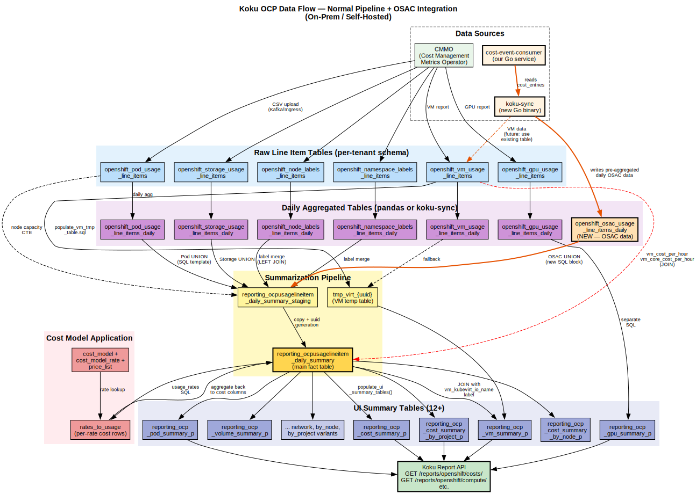

# Koku Integration Strategy — cost-event-consumer

**Date:** 2026-07-08
**Status:** Research / Discussion

## Problem Statement

The cost-event-consumer (this project) is a real-time, event-driven Go
pipeline for OSAC sovereign cloud cost management. Koku is the existing
Red Hat Cost Management product — a batch-oriented Python/Django pipeline
that processes daily CSV uploads from the Cost Management Metrics Operator
(CMMO).

These two systems need to converge. The question is how.

## Koku OCP Data Flow

The diagram below shows Koku's complete OCP data pipeline — from data
sources through raw line items, daily aggregation, summarization, cost
model application, and UI summary tables. The orange elements show where
our OSAC integration plugs in.



### How to read this diagram

**Data Sources (top left):** CMMO (the existing OCP metrics operator)
uploads CSV data. Our cost-event-consumer processes OSAC CloudEvents,
and koku-sync bridges the two systems.

**Raw Line Item Tables (blue):** Where CMMO's per-interval (5-minute)
data lands. Six tables for pods, storage, node labels, namespace labels,
VMs, and GPUs. We do NOT write here — our data is already daily.

**Daily Aggregated Tables (purple):** CMMO's raw data is aggregated to
daily granularity via pandas. Our OSAC table (orange) sits at this level
because koku-sync writes pre-aggregated daily data directly. This is
equivalent to what pandas produces from raw line items.

**Summarization Pipeline (yellow):** The core SQL template reads from all
daily tables and writes to a staging table, then copies to the main fact
table (`reporting_ocpusagelineitem_daily_summary`). Our OSAC data enters
via a conditional `UNION` in this SQL template.

**Cost Model (red):** After data lands in the daily summary, Koku's cost
model SQL applies rates from `cost_model_rate` rows, writes per-rate
costs to `rates_to_usage`, and aggregates back into the daily summary's
cost columns. VM costs use a special path that JOINs back to the raw
VM line items for uptime-based pricing.

**UI Summary Tables (indigo):** `populate_ui_summary_tables()` reads from
the daily summary and produces 12+ pre-aggregated tables optimized for
API queries. Each table serves a specific report view.

**Koku Report API (green):** Reads from the UI summary tables to serve
`/reports/openshift/costs/`, `/reports/openshift/compute/`, etc.

### Our integration path (orange arrows)

```
cost-event-consumer → koku-sync → openshift_osac_usage_line_items_daily (purple layer)
                                    → UNION into staging (yellow layer)
                                      → daily summary → cost model → UI tables → API
```

We skip the blue (raw) layer entirely. koku-sync does the aggregation
that pandas does for CMMO data, writing directly to the daily layer.
From there, Koku's existing pipeline handles everything.

---

## Architectural Differences

| Aspect | cost-event-consumer | Koku |
|---|---|---|
| Language | Go | Python (Django + Celery) |
| Processing model | Real-time (per-event, <1ms) | Batch (daily CSV, hours) |
| Data source | OSAC gRPC Watch + CloudEvents | CMMO CSV uploads via Ingress |
| Transport | gRPC stream + HTTP POST | S3 → Kafka → Celery tasks |
| Tenancy model | Shared tables with `tenant_id` column | **Per-tenant PostgreSQL schemas** (`orgNNNNNNN`) |
| Rate model | `rates` table with `koku_metric` mapping | `cost_model` → `cost_model_rate` with tiered rates + markup + distribution |
| Summary tables | None (query raw `cost_entries`) | **12+ UI summary tables** (partitioned, refreshed via SQL templates) |
| Report API | Flat JSON, no pagination | Nested JSON with `meta/data/total`, pagination, `filter[]/group_by[]` syntax |
| Cost breakdown | Infrastructure / Supplementary | Infrastructure / Supplementary + **raw / markup / usage / total sublayers** |
| Cost distribution | None | Platform, worker, network, storage, GPU costs distributed across projects |

### The Hard Incompatibilities (SaaS)

In SaaS mode, Koku creates per-tenant PostgreSQL schemas (`orgNNNNNNN`),
uses Trino/Hive for parquet processing, and relies on Insights platform
identity. These are major integration barriers.

**For on-prem (`ONPREM=True`), some barriers drop but not all:**

- **Still per-tenant schemas.** Even on-prem, Koku creates `orgNNNNNNN`
  schemas (e.g., `org1234567`). The `ONPREM` flag does NOT switch to the
  `public` schema — it only controls SQL template selection
  (`self_hosted_sql/` vs `trino_sql/`). Verified during the spike:
  koku-sync discovers the schema via `SELECT schema_name FROM api_customer`.
- **Typically one tenant.** On-prem deployments usually have a single
  customer/org, so there's one schema — but it's `org{id}`, not `public`.
- **PostgreSQL only.** On-prem uses `self_hosted_sql/` templates that
  run against PostgreSQL directly — no Trino, no parquet, no S3.
- **Auto-provisioned.** Koku's middleware creates the Customer + Tenant +
  schema on the first request with an `x-rh-identity` header. No manual
  schema creation needed.

**Remaining incompatibilities (even on-prem):**

1. **Summary tables.** Koku's UI reads from 12+ pre-aggregated summary
   tables. Our report API queries `cost_entries` directly. To appear in
   Koku's UI, our data must land in `reporting_ocpusagelineitem_daily_summary`
   and flow through `populate_ui_summary_tables()`.

2. **Cost model entity.** Koku wraps rates in a `cost_model` parent with
   name, source_type, currency, markup percentage, and distribution rules.
   Our rates are standalone rows.

3. **Markup and distribution.** Koku applies markup percentages and
   distributes costs across projects. We have neither.

### The Integration Point: daily_summary → UI summary tables

The pipeline flow in Koku for on-prem is:

```
CSV/Parquet → populate_line_item_daily_summary_table (self_hosted_sql)
            → update_cost_model_costs()   ← rates, markup, distribution
            → populate_ui_summary_tables()  ← 12+ summary tables for UI
```

Our pipeline could wire in at two levels:

**Level 1: Write into `reporting_ocpusagelineitem_daily_summary`.**
Aggregate our `cost_entries` into daily rows matching the ~50 columns of
the daily summary table. Then trigger `update_cost_model_costs()` and
`populate_ui_summary_tables()`. Koku's existing UI and API work without
modification. Source: `ocp_report_db_accessor.py:105` and `:527`.

**Level 2: Write directly into UI summary tables.** Skip the daily
summary and write pre-aggregated data into `reporting_ocp_cost_summary_p`
etc. Faster but more fragile — bypasses Koku's cost model processing.

---

## Integration Strategies

### Strategy A: Feed Koku's Summary Tables

**Concept:** Our pipeline produces metering and cost data. Instead of (or
in addition to) storing it in our tables, write it into Koku's
`reporting_ocpusagelineitem_daily_summary` table in the tenant's schema.
Koku's existing UI, API, and cost model processing take over from there.

**How it would work:**
1. cost-event-consumer processes OSAC events → metering entries → cost entries
2. A sync component aggregates our cost entries into daily summaries
3. Writes into Koku's `reporting_ocpusagelineitem_daily_summary` in the
   correct `orgNNNNNN` schema
4. Triggers Koku's `populate_ui_summary_tables()` to refresh the UI tables
5. Koku's report API serves the data to the UI

**Pros:**
- Uses Koku's existing UI — no new frontend work
- Cost model management (markup, distribution) handled by Koku
- Koku-native report API for consumers

**Cons:**
- **Schema mapping is complex.** The daily summary has ~50 columns. Many
  (pod labels, PVC, storage, GPU) are NULL-able and could be left empty
  for OSAC resources. But the column mapping still needs careful work.
- **Dual write risk.** Data in two places (our tables + Koku tables) can
  drift. Which is authoritative?
- **Koku's cost model processing would re-rate.** If we write raw usage
  into the daily summary, Koku's cost model updater will apply Koku rates
  on top, potentially double-counting our pre-rated costs. Mitigation:
  write pre-rated costs directly into the cost columns and mark the
  `cost_model_rate_type` appropriately.
- **Loses real-time.** Koku's summary tables are daily granularity.
  Our sub-minute data would be aggregated to daily before Koku can use it.

**On-prem note:** With `ONPREM=True`, tables live in a per-tenant schema
(`org{id}`), but typically there's only one tenant. koku-sync discovers
the schema automatically via `SELECT schema_name FROM api_customer`.
The SQL templates under `self_hosted_sql/` run against PostgreSQL, not Trino.

**Verified against code:** `populate_ui_summary_tables()` in
`ocp_report_db_accessor.py:105` iterates `UI_SUMMARY_TABLES` and runs
DELETE/INSERT SQL from `sql/openshift/ui_summary/{table_name}.sql`.
These SQL templates read from `reporting_ocpusagelineitem_daily_summary`
and aggregate into the UI tables. If our data is in the daily summary,
the UI tables get populated automatically.

**Effort:** Medium (on-prem). Schema mapping + daily aggregation component
+ triggering `populate_ui_summary_tables()`. No tenant resolution.

---

### Strategy B: API Gateway / BFF (Backend for Frontend)

**Concept:** Don't share the database. Instead, create an API layer that
queries both systems and presents a unified response. The Koku UI or a
new unified UI calls this gateway, which routes to Koku for traditional
OCP data and to our consumer for OSAC data.

```
UI → API Gateway → Koku API (traditional OCP costs)
                 → cost-event-consumer API (OSAC/MaaS costs)
                 → merge & return unified response
```

**How it would work:**
1. A thin Go or Python service proxies report requests
2. For traditional OCP data: forwards to Koku's report API
3. For OSAC data (VMs, clusters, MaaS): forwards to our report API
4. Merges responses into Koku's expected format
5. The UI sees one API with all data

**Pros:**
- **No shared database.** Each system owns its data.
- **No schema migration.** Koku doesn't need to know about OSAC tables.
- **Incremental.** Can start with OSAC-only data and add Koku fallback later.
- **Clean boundary.** Each system does what it's good at.

**Cons:**
- **Response format translation.** Our flat JSON must be transformed to
  Koku's nested `meta/data/total` with `infrastructure/supplementary` and
  `raw/markup/usage/total` sublayers.
- **Aggregation across systems.** If a tenant has both traditional OCP
  data (in Koku) and OSAC data (in our consumer), the gateway must merge
  them correctly for totals, grouping, pagination.
- **Consistency.** Two systems may disagree on rates, cost models, or
  time boundaries.
- **New UI may be needed.** The existing Koku UI sends specific API calls
  with Koku's filter/group_by syntax. Our API uses different params.

**Effort:** Medium. The gateway itself is simple (proxy + merge). The
hard part is response format translation and cross-system aggregation.

**Proven pattern:** This is the BFF (Backend for Frontend) pattern, widely
used in microservices. Netflix, Spotify, and many RHT products use it.

---

### Strategy C: OSAC as a Koku "Provider"

**Concept:** Register OSAC as a new provider type in Koku (alongside AWS,
Azure, GCP, OCP). Implement the provider-specific ingestion and processing
pipeline within Koku's existing framework. The cost-event-consumer becomes
the ingestion/collection layer that produces data in a format Koku's
provider pipeline can consume.

**How it would work:**
1. Add `OSAC` provider type to Koku (`api/models.py`, `Provider.PROVIDER_OSAC`)
2. Implement `OSACReportDBAccessor` for OSAC-specific table operations
3. Implement `OSACCostModelCostUpdater` for rate application
4. cost-event-consumer writes data to S3 or Kafka in a format Koku's
   listener can pick up (CSV or Parquet)
5. Koku processes it through its standard pipeline: download → process →
   summarize → cost model → UI summary tables

**Pros:**
- **Full Koku integration.** OSAC data appears in Koku's UI natively,
  with all existing features (markup, distribution, tagging, RBAC).
- **Existing pipeline handles scaling, retry, scheduling.**
- **Cost model management unified.** One place to manage rates for all
  provider types.

**Cons:**
- **Massive Koku codebase change.** Adding a provider type touches 20+
  files: models, serializers, views, DB accessors, SQL templates, UI
  mappings, provider maps, and all the cost model pipeline code.
- **Loses real-time.** Koku processes data in daily batches. Real-time
  quota checks and balance checks would still need our consumer.
- **OSAC resources don't fit OCP's model.** Koku's OCP data model is
  deeply pod/namespace/node/PVC-oriented. OSAC resources (VMs, MaaS models,
  bare metal) are different entities with different dimensions.
- **CSV/Parquet overhead.** Converting our real-time events to CSV files
  for Koku to re-ingest adds latency and complexity.

**Verified against code:** Koku's provider system is in `api/models.py`
(Provider class with `PROVIDER_OCP`, `PROVIDER_AWS`, etc.). Adding a new
provider requires implementing: `{Provider}Provider` (authentication),
`{Provider}ReportDBAccessor`, `{Provider}CostModelCostUpdater`,
`{Provider}ReportParquetSummaryUpdater`, report views, provider map,
SQL templates. This is a months-scale effort.

**Effort:** Very large. 3-6 months of Koku development by someone who
knows the Koku codebase deeply.

---

### Strategy D: Shared Database, Separate Pipelines

**Concept:** Both systems write to the same PostgreSQL database but use
different tables. The report API reads from both table sets and merges.
Koku owns its summary tables; we own ours. A shared schema or a thin
view layer unifies them for the UI.

**How it would work:**
1. Deploy both systems against the same PostgreSQL instance
2. Our tables live in a dedicated `osac` schema or alongside Koku in `org{id}`
3. Koku tables live in per-tenant `org{id}` schemas
4. PostgreSQL views or materialized views join across schemas
5. A unified report API (or views) presents the merged data

**Pros:**
- **Single database.** No cross-service API calls for reporting.
- **Each system keeps its pipeline.** No rewrite needed.
- **Views can translate.** A SQL view can reshape our `cost_entries` into
  Koku's column structure.

**Cons:**
- **Schema coupling.** Changes to either system's schema break the views.
- **Cross-schema queries are complex.** Joining `public.cost_entries` with
  `org12345678.reporting_ocp_cost_summary_p` requires dynamic SQL or a
  mapping table.
- **Deployment coupling.** Both systems must target the same DB, which
  complicates deployment and scaling.
- **Koku's per-tenant schemas.** We'd need to replicate our data into
  each tenant's schema, or query across schemas dynamically.

**Effort:** Medium-Large. The view layer is conceptually simple but the
per-tenant schema complication makes it operationally complex.

---

### Strategy E: Koku Adapter in cost-event-consumer

**Concept:** Add a Koku-compatible report API to our consumer. The
existing Koku UI can point at our API (for OSAC data) alongside the
real Koku API (for traditional data). Our API speaks Koku's format.

**How it would work:**
1. Add `/api/v1/reports/openshift/costs/` endpoint to our consumer
2. Response format matches Koku exactly: `meta/data/total` with nested
   `infrastructure/supplementary` blocks and `raw/markup/usage/total`
3. Support Koku's filter/group_by query parameter syntax
4. The UI configuration routes OSAC providers to our endpoint

**Pros:**
- **No Koku code changes.** The UI just calls a different base URL for
  OSAC data.
- **We control the implementation.** Can optimize for real-time queries.
- **Incremental.** Start with cost reports, add other Koku endpoints later.
- **Proven pattern.** API compatibility layers are common (e.g., S3-compatible
  object storage APIs).

**Cons:**
- **Must replicate Koku's response format exactly.** The UI is tightly
  coupled to Koku's JSON structure. Any deviation breaks the UI.
- **Must replicate Koku's query parameter handling.** `filter[time_scope_value]`,
  `group_by[project]`, `order_by[cost]`, etc.
- **No cost model management UI.** Koku's cost model CRUD API would need
  a parallel implementation or a separate management path.
- **No markup/distribution.** The UI expects these columns to exist in
  the response. We'd need to return zeros or implement them.

**Effort:** Medium. The response format is well-documented. The query
parameter handling is complex but finite. No Koku codebase changes.

---

## Recommendation

### Context: On-prem single-tenant changes everything

When viewed as a single-tenant on-prem deployment (`ONPREM=True`), the
Trino/S3 objections disappear and the per-tenant schema is typically just
one (`org{id}`). The integration becomes a tractable PostgreSQL problem:
write data into the OSAC table in the tenant schema, then let Koku's
pipeline aggregate it into the daily summary and UI tables.

### For the PoC (July 31)

**Strategy E (Koku-compatible API)** — quickest path to a demo. Add one
Koku-format endpoint to our consumer. No Koku changes. Effort: 1-2 weeks.

### For production (post-PoC)

**Strategy A (feed daily summary) + E (compatible API)** is now the
recommended combination for on-prem:

1. **Strategy A** — our pipeline writes daily aggregated data into
   `reporting_ocpusagelineitem_daily_summary`. Koku's cost model
   processing, UI summary tables, and report API work unmodified.
   Koku's UI shows OSAC data natively.

2. **Strategy E** — for real-time queries (quota checks, balance checks,
   sub-minute cost reports), our API serves directly. These are OSAC-specific
   features that Koku's daily-batch model can't support.

3. **Strategy B (API Gateway)** — if the UI needs to merge traditional
   OCP data from Koku with real-time OSAC data in a single view.

The **key architectural decision** is the pipeline split:

```
OSAC events → cost-event-consumer → real-time queries (quota, balance)
                                  → daily aggregation → Koku daily_summary
                                                       → Koku UI (batch)
```

This gives the best of both worlds: real-time for OSAC-specific features,
Koku-native for reporting and cost model management.

### What to avoid

- **Strategy C (full Koku provider)** — months of Koku work for diminishing
  returns when Strategy A achieves UI integration much faster.
- **Strategy D (shared database with views)** — unnecessary complexity
  when Strategy A writes directly into the table Koku already reads.
- **Dual cost model management** — pick one place to define rates (Koku
  or our pipeline) and sync the other. Don't let both systems apply rates
  independently.

---

## Strategy F: OSAC Resources as OCP Resources (Hybrid)

### Key Insight: OSAC IS OCP

OSAC provisions OpenShift resources — VMs via OpenShift Virtualization,
clusters via HCP (Hosted Control Planes), bare metal nodes as OCP nodes.
These are not foreign resource types; they are OCP resources with OCP
identities. Koku already has dedicated line item tables for each:

| OSAC resource | Koku line item table | Existing? |
|---|---|---|
| VMs (OpenShift Virtualization) | `openshift_vm_usage_line_items_daily` | **Yes** |
| Clusters / Nodes | `openshift_pod_usage_line_items_daily` | **Yes** |
| Bare metal nodes | `openshift_pod_usage_line_items_daily` | **Yes** |
| MaaS (inference tokens) | — | **No** — needs new table |

### VM column mapping

Koku's `OCPVMUsageLineItemDaily` (in `self_hosted_models.py`) has columns
designed for OpenShift Virtualization VMs. Our OSAC VM data maps directly:

| Our field/meter | Koku VM column | Conversion |
|---|---|---|
| `instance_id` | `resource_id` | direct |
| `tenant_id` | `namespace` | OSAC tenant as K8s namespace |
| — | `vm_name` | `instance_id` or descriptive name |
| `cores` | `vm_cpu_request_cores` | direct |
| `memory_gib` | `vm_memory_request_bytes` | × 1073741824 |
| `vm_uptime_seconds` | `vm_uptime_total_seconds` | direct |
| `vm_cpu_core_seconds` | `vm_cpu_request_core_seconds` | direct |
| `vm_memory_gib_seconds` | `vm_memory_request_byte_seconds` | × 1073741824 |

Koku's VM table also has: `vm_instance_type`, `vm_os`, `vm_guest_os_*`,
`vm_labels`, `vm_cpu_limit_*`, `vm_memory_limit_*`, `vm_cpu_request_sockets`,
`node_capacity_*`. We can populate these from OSAC Watch stream data
where available, or leave NULL (all columns are nullable).

### Cluster/Node column mapping

For cluster-level capacity data, Koku's `OCPPodUsageLineItemDaily` tracks
per-node capacity:

| Our field/meter | Koku Pod column | Conversion |
|---|---|---|
| `cluster_id` | — (metadata, not a column) | Via `source` (provider UUID) |
| `cluster_uptime_seconds` | `node_capacity_cpu_core_seconds` | × node cores |
| `cluster_worker_node_seconds` | aggregate across multiple node rows | 1 row per node |
| `bm_uptime_seconds` | `node_capacity_cpu_core_seconds` | direct |

This is less clean than VMs — cluster-level meters need to be split into
per-node rows. The OSAC Watch stream gives us individual node data, which
maps better than our aggregated `cluster_worker_node_seconds` meter.

### What the pipeline does with VM data

Koku's VM processing path (separate from Pod/Storage):

```
openshift_vm_usage_line_items_daily
  → populate_vm_tmp_table_with_vm_report.sql  (temp table)
  → reporting_ocp_vm_summary_p                (UI table)
  → hourly_cost_virtual_machine.sql           (cost model: vm_cost_per_hour, vm_core_cost_per_hour)
```

Source: `ocp_report_db_accessor.py:_populate_virtualization_ui_summary_table()`

This means: if we write into the VM table, Koku's existing VM cost model
rates (`vm_cost_per_hour`, `vm_core_cost_per_hour`, `vm_cost_per_month`,
`vm_core_cost_per_month`) are applied automatically. These are exactly the
rate types we already map to via `koku_metric` in our `rates` table.

### Where MaaS doesn't fit

MaaS inference data has no OCP equivalent:
- Token dimensions (prompt, completion, cached, reasoning) — no Koku column
- Per-request metering — Koku tracks usage per pod/node/PVC, not per API call
- Inference model identity — Koku has no concept of LLM models

For MaaS, we need either:
- A new self-hosted table (`openshift_osac_maas_line_items_daily`) + SQL template
- Or Strategy E (our own API serves MaaS reports, Koku serves VM/cluster reports)

### Hybrid approach

```
OSAC VMs       → write to openshift_vm_usage_line_items_daily      → Koku VM pipeline
OSAC Clusters  → write to openshift_pod_usage_line_items_daily     → Koku Pod pipeline
OSAC Bare Metal→ write to openshift_pod_usage_line_items_daily     → Koku Pod pipeline
OSAC MaaS      → our API serves directly (Koku has no MaaS concept)
```

**Koku changes needed for VMs/clusters/BM: ZERO.** The existing pipeline
processes the data. Cost models with `vm_cost_per_hour` etc. apply
automatically.

**Koku changes needed for MaaS:** Either a new table + SQL template
(Strategy F variant), or no Koku change (MaaS served by our API).

### Pros

- **Zero SQL template changes** for VMs and clusters
- **Existing cost model rates apply** — `vm_cost_per_hour`, `cluster_cost_per_month`
  work out of the box
- **Existing UI** — VM summary page (`reporting_ocp_vm_summary_p`) shows
  OSAC VMs natively
- **Proven pipeline** — no risk of breaking existing OCP data processing

### Cons

- **Semantic overloading** — OSAC VMs are represented as OpenShift
  Virtualization VMs. They're the same technology, but the provenance
  differs (OSAC-provisioned vs manually created). May confuse operators.
- **Cluster meter splitting** — our `cluster_worker_node_seconds` is an
  aggregate; Koku wants per-node rows
- **MaaS excluded** — can't use this approach for inference data

### Deep Dive: How Koku VM Costs Actually Work

The VM cost pipeline is more complex than "write to VM table, get costs":

```
openshift_vm_usage_line_items
  → populate_vm_tmp_table_with_vm_report.sql
    → tmp_virt_{uuid} (vm_name, node, cpu_request, mem_request)

reporting_ocpusagelineitem_daily_summary (must have data_source='Pod'
  AND pod_labels ? 'vm_kubevirt_io_name')
  → hourly_cost_virtual_machine.sql
    → JOINs daily summary with VM line items on vm_name
    → cost = vm_uptime_hours * hourly_rate
  → hourly_vm_core.sql
    → cost = vm_uptime_hours * vm_cpu_cores * core_hourly_rate
  → reporting_ocp_vm_summary_p.sql
    → JOINs with tmp_virt table for latest VM info
```

**Critical coupling:** The VM cost SQL reads from BOTH the daily summary
AND the VM line items table. Writing to only one isn't enough. The daily
summary row needs `pod_labels = {"vm_kubevirt_io_name": "my-vm"}` and
non-null `pod_usage_cpu_core_hours` / `pod_request_cpu_core_hours`.

**Minimum viable data for VM costs:**

1. `openshift_vm_usage_line_items` row with:
   - `vm_name`, `vm_uptime_total_seconds > 0`, `vm_cpu_request_cores`
   - `source`, `year`, `month`, `usage_start`

2. `reporting_ocpusagelineitem_daily_summary` row with:
   - `data_source = 'Pod'`
   - `pod_labels = {"vm_kubevirt_io_name": "vm-name"}`
   - `pod_usage_cpu_core_hours IS NOT NULL`
   - `pod_request_cpu_core_hours IS NOT NULL`
   - `namespace`, `cluster_id`, `node`, `source_uuid`, `report_period_id`

3. Cost model with `vm_cost_per_hour` or `vm_core_cost_per_hour` rate
   linked to the provider via `CostModelMap`

### Columns that Drive Costs (verified against SQL)

| Rate metric | Required column(s) | NULL behavior |
|---|---|---|
| `vm_cost_per_hour` | `vm_uptime_total_seconds` (VM table) | Zero cost if NULL |
| `vm_core_cost_per_hour` | `vm_uptime_total_seconds` × `vm_cpu_request_cores` | Skipped if table missing |
| `cpu_core_request_per_hour` | `pod_request_cpu_core_hours` | COALESCE to 0 |
| `memory_gb_request_per_hour` | `pod_request_memory_gigabyte_hours` | COALESCE to 0 |
| `node_cost_per_month` | `node_capacity_cpu_core_hours` | **Skipped if NULL** |
| `cluster_cost_per_month` | `cluster_capacity_cpu_core_hours` | **Skipped if NULL** |

### Revised Assessment

Writing VMs into the existing OCP VM table is viable but requires:
1. ALSO writing a daily summary row (the summarization SQL creates this
   from pod data normally, but we'd need to create it for OSAC VMs)
2. Setting `pod_labels` with `vm_kubevirt_io_name` — this is how Koku
   identifies VM-related pod rows
3. Creating a Koku cost model with VM rates linked to our provider

This is MORE work than the new OSAC table approach for the spike,
because we need to populate TWO tables with coupled data. But for
production it's the right path — it uses Koku's proven VM cost model.

### Effort (revised)

**Medium** for VMs (two coupled tables + cost model setup).
**Medium** for clusters (per-node disaggregation + capacity columns).
**Separate solution** for MaaS.

---

## Key Decisions Needed

| # | Decision | Impact |
|---|---|---|
| 1 | Is Koku the long-term single system, or will both coexist? | Determines whether to invest in Strategy C (full provider) or B (gateway) |
| 2 | Does the OSAC pipeline need Koku's cost model features (markup, distribution)? | If yes, Strategy C or A. If no, Strategy E or B. |
| 3 | Which UI serves OSAC data — existing Koku UI or a new one? | Existing → must match Koku API format. New → more freedom. |
| 4 | How are tenants mapped between OSAC and Koku? | OSAC tenant → Koku org → PostgreSQL schema mapping needed for any integration |
| 5 | Is real-time reporting a requirement or nice-to-have? | If required, Koku's daily batch model is insufficient — our pipeline must serve real-time queries directly |

---

## Appendix: Koku Schema Quick Reference

### Per-tenant schema pattern
```
orgNNNNNNNN.reporting_ocpusagelineitem_daily_summary   (main line items)
orgNNNNNNNN.reporting_ocp_cost_summary_p               (UI: cost by cluster)
orgNNNNNNNN.reporting_ocp_cost_summary_by_project_p    (UI: cost by project)
orgNNNNNNNN.reporting_ocp_cost_summary_by_node_p       (UI: cost by node)
orgNNNNNNNN.reporting_ocp_pod_summary_p                (UI: pod summary)
orgNNNNNNNN.reporting_ocp_pod_summary_by_project_p     (UI: pods by project)
orgNNNNNNNN.reporting_ocp_pod_summary_by_node_p        (UI: pods by node)
orgNNNNNNNN.reporting_ocp_volume_summary_p             (UI: volume summary)
orgNNNNNNNN.reporting_ocp_volume_summary_by_project_p  (UI: volumes by project)
orgNNNNNNNN.reporting_ocp_network_summary_p            (UI: network)
orgNNNNNNNN.reporting_ocp_gpu_summary_p                (UI: GPU)
orgNNNNNNNN.reporting_ocp_virtual_machine_summary_p    (UI: VMs)
orgNNNNNNNN.cost_model                                 (rate definitions)
orgNNNNNNNN.cost_model_rate                            (per-metric rates)
orgNNNNNNNN.rates_to_usage                             (per-rate cost rows)
```

### Key daily summary columns (our mapping)

| Koku column | Our equivalent | Notes |
|---|---|---|
| `cluster_id` | `resource_id` (for clusters) | Different semantics — Koku clusters contain pods/nodes |
| `namespace` | `project_id` (OSAC project) | Different concept — OCP namespace vs OSAC project |
| `node` | `resource_id` (for VMs) | Koku node = K8s node; our VM ≠ K8s node |
| `usage_start` / `usage_end` | `period_start` / `period_end` | Compatible but different granularity (daily vs sub-minute) |
| `pod_request_cpu_core_hours` | `vm_cpu_core_seconds / 3600` | Unit conversion needed |
| `pod_request_memory_gigabyte_hours` | `vm_memory_gib_seconds / 3600` | Unit conversion needed |
| `cost_model_cpu_cost` | `cost_amount` (for cpu meter) | Different breakdown structure |
| `infrastructure_raw_cost` | `cost_amount` (Infrastructure type) | Koku adds markup on top |
| `supplementary_usage_cost` | `cost_amount` (Supplementary type) | JSON structure in Koku |

### Cost model rate chain
```
API → CostModel → CostModelRate → OCPCostModelCostUpdater
  → usage_rates/  (SQL: apply per-unit rates)
  → monthly_cost_ (SQL: apply per-month fixed rates)
  → tag_rates      (SQL: apply tag-based rates)
  → vm_usage_costs (SQL: apply VM-specific rates)
  → aggregate      (SQL: roll up rates_to_usage → daily_summary)
  → markup         (SQL: apply markup percentage)
  → distribute     (SQL: distribute platform costs to projects)
  → populate_ui    (SQL: refresh 12+ summary tables)
```

Source: Koku PR #6174, `.claude/rules/cost-pipeline.md`
