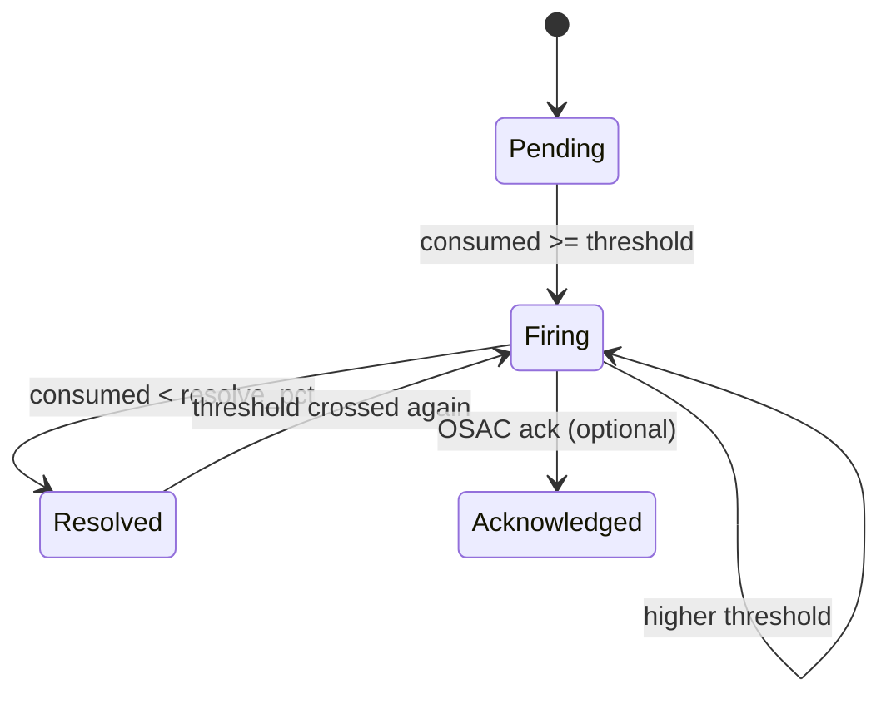

# Cost ↔ OSAC Quota Integration — Technical Spec (Draft)

> **Status:** Partially implemented — see phase table below for current state
> **Parent:** [alerting-osac-integration.md](alerting-osac-integration.md) — options, ownership, constraints
> **Related:** [data-model.md](../data-model.md), [event-types.md](../event-types.md)

Wire formats and paths marked **[implemented]** reflect actual PoC code. Sections marked **[aspirational]** remain unbuilt and are starting points for the next implementation round.

---

## Limit sync — OSAC → Cost

> **[aspirational]** OSAC reconciler sync is not yet implemented. Quotas are currently seeded locally at startup.

**Current PoC behaviour (implemented):** On startup, `rating.SeedDefaultQuotas()` populates the `quotas` table with hardcoded limits for demo tenants (`tenant-acme`, `tenant-globex`, `tenant-initech`, `shared`). No OSAC REST calls are made for quota sync.

**Seeded meters and limits (per tenant):**

| Meter | Limit | Unit |
|---|---|---|
| `vm_cpu_core_seconds` | 360,000 | core_seconds |
| `vm_memory_gib_seconds` | 1,440,000 | gib_seconds |
| `vm_uptime_seconds` | 86,400 | seconds |
| `maas_tokens_in` | 10,000,000 | tokens |
| `maas_tokens_out` | 5,000,000 | tokens |
| `maas_requests` | 100,000 | requests |

**Future OSAC sync design (aspirational):**

Same pattern as inventory: **periodic reconciler** (5–15 min + startup) + optional **Watch** events (`Quota`/`Budget` CREATED/UPDATED/DELETED). Reconciler alone is sufficient for PoC.

> Paths and shape to confirm with OSAC.

| Method | Endpoint |
|---|---|
| `GET` | `/api/fulfillment/v1/quotas`, `/quotas/{id}` |
| `GET` | `/api/fulfillment/v1/budgets`, `/budgets/{id}` |

Auth: Bearer JWT (same as other fulfillment List endpoints).

**Quota resource shape:**

```json
{
  "id": "019ec123-abcd-1234-abcd-ef5678901234",
  "metadata": {
    "name": "monthly-cpu-quota",
    "tenant": "tenant-acme",
    "creation_timestamp": "2026-06-01T00:00:00Z"
  },
  "spec": {
    "project_id": "019eb257-8108-773f-99c4-5d7642e9e7d8",
    "resource_type": "compute_instance",
    "meter_name": "vm_cpu_core_seconds",
    "limit_value": 10000.0,
    "unit": "core_seconds",
    "period": "monthly",
    "effective_from": "2026-06-01T00:00:00Z",
    "effective_to": null,
    "thresholds": [50, 70, 90, 100]
  },
  "status": { "state": "QUOTA_STATE_ACTIVE" }
}
```

Budgets: same pattern with `limit_value` + `currency` instead of `meter_name` / `unit`.

**Cost cache (`quotas` table) — aspirational:** read-only mirror keyed by `external_id` (OSAC UUID). The current table does not have `external_id`, `synced_at`, or `deleted_at` columns — these are needed before OSAC sync can be wired up.

| Condition | Cost behavior |
|---|---|
| Limit not synced | Skip evaluation; log warning |
| Limit deleted in OSAC | Soft-delete cache row; resolve firing alerts |
| Limit updated | Overwrite on next sync; re-evaluate next sweep |
| Sync lag | Acceptable within reconciler interval |

---

## Alert lifecycle (REQ-10)

**[implemented — simplified]** The PoC implements a fire-once model. Full state machine with hysteresis, resolution, and acknowledgement is aspirational.

**Implemented behaviour:** After each rating sweep, `rating.evaluateThresholds()` sums metered consumption per (tenant, meter) for the current calendar month and compares against quota limits. For each threshold crossed, it calls `store.InsertAlert()` with `ON CONFLICT (tenant_id, meter_name, threshold_pct, period) DO NOTHING`. Alerts are written once and never updated — there is no `resolved` or `acknowledged` transition.

Thresholds are hardcoded to `[50, 70, 90, 100]` percent. No `alert_rules` table exists.

**Aspirational full state machine:**



| State | Cost action | OSAC |
|---|---|---|
| `pending` | None | None |
| `firing` | POST CloudEvent | Banner / notify; OPA may throttle |
| `resolved` | POST CloudEvent `state: resolved` | Clear warnings; relax OPA |
| `acknowledged` | Stop retries | — |

Local state: `alerts` table — see [data-model.md](../data-model.md). Optional `alert_rules` for per-quota thresholds.

---

## Outbound CloudEvent — `cost.quota.threshold.v1`

> **[aspirational]** Not yet implemented. No webhook emitter exists in the PoC. Threshold breaches are stored in the `alerts` table only; nothing is pushed to OSAC.

**Planned design:**

Same CloudEvents 1.0 envelope as [event-types.md](../event-types.md), with:

- `type`: `cost.quota.threshold.v1`
- `source`: `cost.management.alerting`
- `subject`: `tenant_id`
- `id`: stable hash of `(quota_id, threshold_pct, period_start, state)` for dedup

**Delivery:**

```
POST {OSAC_ALERT_WEBHOOK_URL}
Content-Type: application/cloudevents+json
Authorization: Bearer {service_account_token}
```

Cost retries with exponential backoff (max 5 attempts); `2xx` and duplicate `ce-id` = success. OPA may consume push events to refresh bundles but **must not rely on push alone** for create gates.

**`data` payload:**

| Field | Required | Notes |
|---|---|---|
| `state`, `limit_kind`, `tenant_id`, `quota_id` | yes | `state`: `firing`, `resolved`, `acknowledged` |
| `threshold_pct`, `threshold_level`, `consumed_*`, `limit_value` | yes | `threshold_level`: `warning`, `approaching`, `critical`, `exceeded` |
| `period`, `period_start`, `period_end` | yes | ISO8601 |
| `project_id`, `meter_name`, `resource_type`, `unit`, `currency` | nullable | Quota: meter fields set; budget: `currency` set, meter fields null |

Resolved events use the same schema with `"state": "resolved"` and `consumed_pct` below the resolve bound.

**Example (`data`, quota `firing`):**

```json
{
  "state": "firing",
  "limit_kind": "quota",
  "tenant_id": "tenant-acme",
  "project_id": "019eb257-8108-773f-99c4-5d7642e9e7d8",
  "quota_id": "019ec123-abcd-1234-abcd-ef5678901234",
  "resource_type": "compute_instance",
  "meter_name": "vm_cpu_core_seconds",
  "period": "monthly",
  "period_start": "2026-06-01T00:00:00Z",
  "period_end": "2026-06-30T23:59:59Z",
  "threshold_pct": 70.0,
  "threshold_level": "approaching",
  "consumed_value": 7200.0,
  "limit_value": 10000.0,
  "consumed_pct": 72.0,
  "unit": "core_seconds",
  "currency": null
}
```

**Budget delta:** same type; `limit_kind: "budget"`, `meter_name` / `resource_type` / `unit` null, `currency` required (e.g. `"USD"`).

---

## Pull API — quota/budget status (REQ-9)

**[implemented — simplified]** The pull API is live at a different path with a condensed response shape.

**Implemented endpoint:**

```
GET /api/v1/quotas/{tenant_id}
```

Handler: `ingest.handleQuotaStatus`. No query params. Always evaluates the current calendar month.

**Implemented response shape:**

```json
{
  "tenant_id": "tenant-acme",
  "period": "2026-06",
  "quotas": [
    {
      "meter_name": "vm_cpu_core_seconds",
      "unit": "core_seconds",
      "limit": 360000.0,
      "consumed": 7200.0,
      "percentage": 2.0,
      "thresholds": {
        "50": false,
        "70": false,
        "90": false,
        "100": false
      },
      "alerts": []
    }
  ]
}
```

`thresholds` is a map of threshold percentage string → boolean (whether that level has been crossed). `alerts` lists any `AlertRecord` rows for this tenant/meter/period (inserted by the threshold evaluator).

**Differences from aspirational spec:**

| Aspirational | Implemented |
|---|---|
| Path `/api/cost/v1/tenants/{id}/quota-status` | Path `/api/v1/quotas/{id}` |
| Separate `quotas` + `budgets` arrays | Single `quotas` array (no budget support) |
| `evaluated_at`, `quota_id`, `limit_kind`, `period_start/end`, `within_limit`, `highest_threshold_fired`, `status` field | `period` label only; no `evaluated_at`, `within_limit`, `status` enum, or per-quota metadata |
| Query params (`project_id`, `meter_name`, `limit_kind`) | None |
| Single-quota shortcut endpoint | Not implemented |
| Auth: Bearer JWT | No auth on quota endpoint in current PoC |

**`status` enum (aspirational — not yet emitted):**

| `status` | Condition |
|---|---|
| `ok` | Below 50% |
| `warning` | ≥50%, <70% |
| `approaching` | ≥70%, <90% |
| `critical` | ≥90%, <100% |
| `exceeded` | ≥100% |

`within_limit` = `consumed_pct < 100`. Grace periods are applied by OSAC at enforce time, not Cost.

---

## Schema extensions

See [data-model.md](../data-model.md).

Missing vs. aspirational spec: `external_id` (OSAC UUID), `synced_at`, `deleted_at`, per-quota `thresholds` array. These are required before OSAC reconciler sync can be added.

**`alert_rules` table:** Not implemented. Thresholds are hardcoded to `[50, 70, 90, 100]` in `rating.evaluateThresholds()` and `ingest.handleQuotaStatus()`.


Missing vs. aspirational spec: `limit_kind`, `project_id`, `period_start`, `period_end`, `threshold_level`, `delivery_status`, `last_delivery_at`, `delivery_attempts`, `ce_id`. These are required for outbound CloudEvent delivery tracking and budget support.

---

## Evaluation pseudocode

**[implemented — see `rating.evaluateThresholds()`]**

The evaluator runs at the end of each rating sweep (not directly post-metering). When the rating batch is empty it still calls `evaluateThresholds()` so quota checks happen even when no new metering arrived.

```
[rating sweep completes (or batch is empty)]
  → AllTenantsWithQuotas(now)
  → for each tenant:
      → QuotasForTenant(tenant, now)
      → for each quota:
          → consumed = MeteringSum(tenant, meter_name, period_start, period_end)
          → pct = consumed / limit_value * 100
          → for each threshold in [50, 70, 90, 100]:
              → if pct >= threshold:
                  → InsertAlert(... ON CONFLICT DO NOTHING)
                  → log "threshold alert fired" if inserted
```

Implemented `MeteringSum` query (matches spec):

```sql
SELECT COALESCE(SUM(value), 0)
FROM metering_entries
WHERE tenant_id = $1 AND meter_name = $2
  AND period_start >= $3 AND period_end <= $4;
```

Period window: first day of current calendar month → first day of next month.

**Not yet implemented:**
- Hysteresis / resolution (alerts are insert-once, never cleared)
- `project_id` filter in consumption aggregation
- Budget evaluation: `SUM(cost_entries.cost_amount)` over the same window
- Outbound CloudEvent after state change

---

## PoC implementation plan

| Phase | Deliverable | Status |
|---|---|---|
| **P0** | Quotas table + seeded limits | **Done** (seeded locally; OSAC sync not yet wired) |
| **P1** | `alert_rules`; configurable thresholds | **Skipped** — thresholds hardcoded to `[50, 70, 90, 100]` in rating and ingest |
| **P2** | Quota evaluator (post-sweep) | **Done** — `rating.evaluateThresholds()` runs after each rating batch |
| **P3** | `alerts` lifecycle + hysteresis | **Partial** — fire-once `alerts` table; no resolution or hysteresis |
| **P4** | Pull API | **Done** — `GET /api/v1/quotas/{tenant_id}`; shape differs from spec |
| **P5** | Push webhook emitter | **Not started** — requires `delivery_status` columns + OSAC webhook URL |
| **P6** | Budget evaluation | **Not started** — `CostSum` query exists; no budget table or evaluator |

**OSAC sync (P0 upgrade):** adding `external_id`, `synced_at`, `deleted_at` to `quotas` and wiring a reconciler against `/api/fulfillment/v1/quotas` is the next concrete step to move from local seeds to live limits.

Minimum demo achieved: seeded quotas + P2 (evaluator) + P4 (pull API) on `vm_cpu_core_seconds` and other meters.

---

## Testing

| Test | Assert | Status |
|---|---|---|
| Fire at 70% | Alert row inserted after metering crosses threshold | **Testable now** (no CloudEvent yet) |
| No duplicate fires | Single `firing` row held for 3 sweeps (UNIQUE constraint) | **Testable now** |
| Hysteresis | `resolved` event below 65% | **Aspirational** — not implemented |
| Pull API | `consumed_value` matches `SUM(metering_entries)` | **Testable now** |
| Webhook retry | 503 then 200 → eventual delivery | **Aspirational** — webhook not implemented |
| Limit sync | OSAC quota CRUD reflected in Cost cache after reconciler | **Aspirational** — OSAC sync not implemented |
| Period boundary | Counters reset on new period | **Testable now** (period filter in `MeteringSum`) |

---

## References

- [alerting-osac-integration.md](alerting-osac-integration.md) — options & ownership
- [data-model.md](../data-model.md)
- [event-types.md](../event-types.md)
- OSAC fulfillment-service — `database_notifier.go`, `events_server.go`, `authz.rego`, `event_type.proto`
