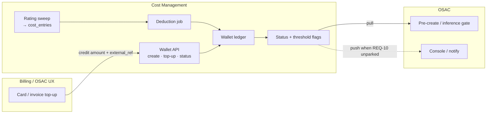

# Prepaid Wallets — Technical Spec (Draft)

> **Status:** PoC draft — for Cost + OSAC review
> **Requirements:** REQ-14 ([COST-7939](https://redhat.atlassian.net/browse/COST-7939)); product feature [COST-7938](https://redhat.atlassian.net/browse/COST-7938)
> **Source:** AI Grid MB-005 (prepaid / hybrid consumption models)
> **Related:** [alerting-osac-integration.md](alerting-osac-integration.md) · [alerting-spec-draft.md](alerting-spec-draft.md) · [cost-calculation-spec-draft.md](../pricing/cost-calculation-spec-draft.md) · [ai-grid-reporting-api.md](../reporting/ai-grid-reporting-api.md) · [REQ-14 overview](../../requirements/poc_requirements_overview.md#req-14-wallets-prepaid-balance)

Do not treat wire formats or schema details here as an agreed contract. This draft proposes ownership, ledger shape, APIs, and deduction mechanics so the team can decide PoC scope before implementation.

---

## 1. Purpose

This spec defines how Cost Management supports **prepaid wallets** for AI Grid / Sovereign Cloud providers.

**Wallets answer:** how much prepaid balance remains, after top-ups and metered spend deductions?

| Concern | Spec |
|---|---|
| How much capacity / tokens were used? | [metering-spec-draft.md](../metering/metering-spec-draft.md) |
| What does that cost? | [cost-calculation-spec-draft.md](../pricing/cost-calculation-spec-draft.md) |
| Am I within a spend/usage *ceiling*? | [alerting-osac-integration.md](alerting-osac-integration.md) (REQ-9) |
| How much *prepaid cash* remains? | **This spec (REQ-14)** |

Settlement happens at **top-up** (money already collected). Metered usage then **draws down** that balance. That is commercially distinct from a budget (a ceiling on usage that will still be billed).

**Hybrid funding (MB-005):** a single enterprise profile must concurrently track **postpaid monthly corporate invoices** alongside **dedicated prepaid wallets for experimental teams**. Cost therefore supports scoped wallets and **selective** deduction — only spend that matches a wallet is drawn down; other spend stays on the postpaid / invoice path.

---

## 2. Scope

### In Scope (PoC)

| Item | Notes |
|---|---|
| Wallet ledger | Create wallet, top up, adjust, query balance |
| Tenant + project wallets | Project wallet = “experimental team” prepaid; tenant wallet optional |
| Selective spend deduction | Only `cost_entries` matching a wallet scope are deducted; unmatched = postpaid |
| Status API | Remaining balance, % remaining, threshold flags (REQ-9 latency class); filterable by project |
| Low-balance alerts | Reuse REQ-10 alert lifecycle / push-or-pull pattern |
| Audit trail | Immutable ledger entries for top-ups, deductions, adjustments (= Cost audit for PoC) |
| Coexistence with budgets / postpaid | Tenant may have wallet *and* budget/quota; hybrid postpaid + prepaid concurrently |

### Out of Scope (PoC)

| Item | Owner / reason |
|---|---|
| Payment gateway / card capture | External billing (Lago, Zuora, etc.) or OSAC UX |
| Postpaid corporate invoice generation | Billing system — Cost still rates `cost_entries` for reporting |
| Hard stop on zero balance | OSAC enforcement (OPA / check-balance), same as REQ-9 |
| Reserved allocations / billing multipliers | Customer billing system per MB-005 |
| Cost UI for wallet management | Post-PoC unless needed for demo |
| Multi-currency FX | Single currency per wallet for PoC (`USD`) |
| Overdraft / credit lines | Balance floors at zero unless explicitly decided |

---

## 3. Concepts

### 3.1 Wallet vs budget vs quota

| Concept | Question | Settlement | Period | Home |
|---|---|---|---|---|
| **Quota** | How much am I *allowed* to use? | N/A (usage units) | Rolling / calendar | REQ-9 |
| **Budget** | How much am I *allowed* to spend ($)? | Post-paid (bill later) | Typically period-bound | REQ-9 |
| **Wallet** | How much prepaid balance remains? | Pre-paid (settled at top-up) | No spend-by date; balance carries | **REQ-14** |

Both wallet and budget may exist for the same tenant:

- Budget: “do not spend more than $5,000 this month” (ceiling; unused amount is not cash)
- Wallet: “$1,000 was prepaid; deduct until balance hits zero / floor”

Hybrid funding example (same enterprise / tenant):

- Corporate projects: no wallet → metered cost accrues for **postpaid monthly invoice** (billing system)
- Experimental team project: dedicated project wallet → that project’s metered cost **draws down** prepaid balance
- Enterprise may still have a tenant-level budget/quota ceiling evaluated independently (REQ-9)

### 3.2 Why not “budget with no time limit”?

Reusing budgets for wallets is tempting (a shrinking monetary number) but is a poor product fit:

1. **Wrong admin model.** OSAC / tenant admins should think in top-up / remaining balance / low-balance alerts — not “a budget with no spend-by date.”
2. **Wrong settlement model.** Top-up money is already in the provider’s coffers. Treating draw-down as “budget consumption” implies spend still needs to be billed.

Shared machinery under the hood (threshold evaluator, alert table, pull status API) is fine; the **user-facing concept and ledger** must remain explicit prepaid balance.

### 3.3 Key terms

| Term | Meaning |
|---|---|
| **Wallet** | Prepaid balance account scoped to tenant or project (`project_id` null = tenant-scoped) |
| **Experimental team wallet** | PoC: project-scoped wallet for a team under an enterprise tenant |
| **Top-up** | Credit that increases available balance (settlement external) |
| **Deduction** | Debit equal to newly rated `cost_entries` that match wallet scope |
| **Postpaid path** | Cost with no matching wallet — remains in `cost_entries` for invoicing; no ledger debit |
| **Adjustment** | Manual credit/debit for disputes, corrections, promotions |
| **Available balance** | `balance` after deductions; never below configured floor (default `0`) |
| **Reference balance** | Amount used as denominator for “% remaining” (see §6.3) |
| **Low-balance threshold** | Configurable % of reference (or absolute amount) that fires alerts |

---

## 4. Ownership

Mirrors the REQ-9 / REQ-10 split: Cost owns money math and status; OSAC owns gates; billing owns payment capture.

| Concern | Owner | Notes |
|---|---|---|
| Payment capture / invoice at top-up | **Billing system** (or OSAC UX calling it) | Lago/Zuora/etc. — OUT of Cost |
| Postpaid corporate monthly invoice | **Billing system** | Uses rated cost; Cost does not issue invoices |
| Wallet create / top-up / adjust API | **Cost** | Ledger source of truth for remaining balance (unlike quotas, where OSAC owns limit CRUD) |
| Top-up UX | **TBD** — OSAC or billing console | Cost exposes API only for PoC |
| Metering + rating → cost amount | **Cost** | Existing sweeps → `cost_entries` (all spend, prepaid or not) |
| Deduct cost from wallet | **Cost** | Post-rating debit **only** for wallet-matched scope |
| Wallet status API (pull) | **Cost** → **OSAC** | Same latency class as REQ-9 (`< 500 ms` target); project-aware |
| Low-balance alerts (push) | **Cost** → **OSAC** | Pairs with REQ-10 (parked); pull flags sufficient for PoC |
| Hard stop / deny provisioning | **OSAC** | Uses pull status; Cost never enforces |
| Audit of payment side | **Billing system** | Cost audits ledger ops only |



---

## 5. Architecture

### 5.1 End-to-end flows

**1 — Top-up:** Billing captures payment → calls Cost `POST .../wallets/{id}/top-ups` with amount + external payment id → Cost credits ledger → balance increases → status API reflects new balance.

**2 — Spend deduction:** Metering sweep → rating sweep writes `cost_entries` → wallet deduction consumes unapplied cost → ledger debit → balance decreases.

**3 — Low-balance alert:** After deduction, `% remaining` crosses threshold → alert state `firing` (REQ-10 pattern) → visible on pull status; optional push to OSAC.

**4 — Pre-create / inference gate (OSAC):** OSAC pulls wallet status → `within_balance: false` or `balance_status: depleted` → OPA denies / throttles. Cost does not block.

```mermaid
sequenceDiagram
    participant Billing
    participant Cost
    participant OSAC
    participant OPA

    Billing->>Cost: POST top-up ($100, payment_ref)
    Cost-->>Billing: balance = 100

    Note over Cost: metering → rating → cost_entries
    Cost->>Cost: deduct $12 from wallet
    Cost-->>Cost: balance = 88; maybe fire low-balance

    OSAC->>Cost: GET wallet status
    Cost-->>OSAC: remaining 88, pct 88%, status ok
    OSAC->>OPA: authorize?
    OPA-->>OSAC: allow / deny
```

### 5.2 Placement in inventory-watcher

Proposed PoC wiring (same process as quotas):

| Component | Role |
|---|---|
| HTTP ingest / Cost API | Wallet CRUD, top-up, status, ledger query |
| Rating sweep (post-step) | Or dedicated wallet sweep after rating: apply un-deducted `cost_entries` |
| Alert evaluator | Treat low-balance like budget thresholds (`limit_kind: wallet`) |
| PostgreSQL | `wallets` + `wallet_ledger_entries` (+ reuse `alerts`) |

---

## 6. Data model (proposed)

> Proposed — confirm against [data-model.md](../../data-model.md) when implementing. Not built today.

### 6.1 `wallets`

Current balance cache + policy. Ledger is authoritative for history; `balance` is the fast-read projection.

```
wallets
  id                 UUID PK
  tenant_id          TEXT NOT NULL
  project_id         TEXT NULL          -- NULL = tenant-scoped wallet
  currency           TEXT NOT NULL      -- 'USD'
  balance            DECIMAL NOT NULL   -- available funds (projection)
  balance_floor      DECIMAL NOT NULL DEFAULT 0
  reference_balance  DECIMAL NOT NULL   -- denominator for % remaining (see §6.3)
  lifecycle_state    TEXT NOT NULL      -- active | frozen | closed
  thresholds         JSONB              -- e.g. [50, 25, 10, 0] (% remaining)
  created_at         TIMESTAMPTZ
  updated_at         TIMESTAMPTZ
  UNIQUE (tenant_id, COALESCE(project_id, ''))
```

### 6.2 `wallet_ledger_entries` (immutable)

```
wallet_ledger_entries
  id                 BIGSERIAL PK
  wallet_id          UUID NOT NULL REFERENCES wallets(id)
  entry_type         TEXT NOT NULL      -- top_up | deduction | adjustment | reversal
  amount             DECIMAL NOT NULL   -- signed: +credit / -debit
  balance_after      DECIMAL NOT NULL
  currency           TEXT NOT NULL
  cost_entry_id      BIGINT NULL        -- set for deductions
  external_ref       TEXT NULL          -- billing payment id / Lago invoice id
  reason             TEXT NULL          -- adjustment notes
  created_at         TIMESTAMPTZ NOT NULL
  created_by         TEXT NULL          -- service account / actor
```

Rules:

- Append-only; never update/delete ledger rows in normal operation
- Every mutation updates `wallets.balance` in the same transaction
- Deduction is idempotent per `cost_entry_id` (unique partial index where not null)
- Top-ups idempotent on `(wallet_id, external_ref)` when `external_ref` present

### 6.3 Reference balance for “% remaining”

REQ-14 example: alert when remaining funds fall below X% of the topped-up amount.

**Proposed PoC rule:**

| Event | Effect on `reference_balance` |
|---|---|
| Wallet create | `0` |
| Top-up `+A` | `reference_balance += A` |
| Deduction | unchanged |
| Adjustment credit | optional: treat like top-up (configurable) |
| Adjustment debit | unchanged |

Then:

```
remaining_pct = (balance / reference_balance) × 100   -- if reference_balance > 0
```

Alternatives (open): last top-up only; rolling 30-day credits; absolute thresholds only (`balance < $50`). PoC should support **percent of reference** and **absolute floor** thresholds.

### 6.4 Relationship to `cost_entries`

```
cost_entries (existing)
  → wallet deduction selects rows not yet applied
  → inserts wallet_ledger_entries (deduction)
  → marks cost_entry as wallet_applied (column or join table)
```

**Proposed:** `wallet_cost_applications (cost_entry_id, ledger_entry_id, amount_applied)` (or `applied_amount` on `cost_entries`) so a cost row can be **partially** applied across multiple ledger debits after a later top-up. Do **not** use a unique `cost_entry_id` alone for idempotency — idempotency is `sum(amount_applied) ≤ cost_amount`.

Insufficient balance: deduct down to `balance_floor`; leave remainder of cost **unapplied** and surface `insufficient_funds` / `unapplied_cost_amount` on status (OSAC decides hard stop). Do **not** silently drop cost — financial record stays in `cost_entries` for postpaid reporting and later wallet resume after top-up.

**Currency:** only deduct when `cost_entries.currency` matches `wallets.currency`; otherwise skip with a metric/log (PoC is single-currency `USD`).

---

## 7. APIs (proposed)

Paths follow the existing PoC HTTP API under inventory-watcher `INGEST_LISTEN_ADDR` (e.g. `:8020`), same `/api/v1/...` prefix as quotas and reports (see [api-reference.md](../../api-reference.md)).

### 7.1 Manage wallet

| Method | Endpoint | Purpose |
|---|---|---|
| `POST` | `/api/v1/wallets` | Create wallet (`tenant_id` in body; optional `project_id`, `thresholds`, `currency`) |
| `GET` | `/api/v1/wallets/{tenant_id}` | List wallets + status for tenant (OSAC gate) |
| `GET` | `/api/v1/wallets/{tenant_id}/{wallet_id}` | Get wallet + balance |
| `POST` | `/api/v1/wallets/{tenant_id}/{wallet_id}/top-ups` | Credit balance |
| `POST` | `/api/v1/wallets/{tenant_id}/{wallet_id}/adjustments` | Manual credit/debit |
| `GET` | `/api/v1/wallets/{tenant_id}/{wallet_id}/ledger` | Audit trail (paginated) |

**Create body (experimental team / project wallet):**

```json
{
  "tenant_id": "tenant-acme",
  "project_id": "project-skunkworks",
  "currency": "USD",
  "thresholds": [50, 25, 10],
  "balance_floor": 0
}
```

`project_id: null` creates a tenant-scoped wallet (optional whole-enterprise prepaid). Hybrid demos typically create **only** project wallets and leave corporate projects on postpaid.

**Top-up body:**

```json
{
  "amount": 100.00,
  "currency": "USD",
  "external_ref": "lago_inv_01HZX...",
  "idempotency_key": "topup-acme-2026-07-20-1"
}
```

### 7.2 Status pull (OSAC gate) — REQ-14 ↔ REQ-9 latency

```
GET /api/v1/wallets/{tenant_id}
```

Parallel to `GET /api/v1/quotas/{tenant_id}`. Query: optional `project_id`, `wallet_id`.

**Hard latency target:** same as REQ-9 — **`< 500 ms`**, served from `wallets` projection (not raw ledger scan).

**Response:**

```json
{
  "tenant_id": "tenant-acme",
  "evaluated_at": "2026-07-20T15:01:05Z",
  "wallets": [
    {
      "wallet_id": "019f0123-abcd-7890-abcd-ef1234567890",
      "project_id": "project-skunkworks",
      "currency": "USD",
      "balance": 88.00,
      "reference_balance": 100.00,
      "remaining_pct": 88.0,
      "balance_floor": 0,
      "lifecycle_state": "active",
      "balance_status": "ok",
      "within_balance": true,
      "insufficient_funds": false,
      "unapplied_cost_amount": 0,
      "thresholds_breached": [],
      "highest_threshold_fired": null
    }
  ]
}
```

OSAC gates for an experimental team should query with `?project_id=...` (or use the matching wallet in the list). Projects with no wallet are postpaid — absence of a wallet is not an error.

| Field | Values (proposed) |
|---|---|
| `lifecycle_state` | `active` \| `frozen` \| `closed` (wallet policy) |
| `balance_status` | `ok` \| `warning` / `approaching` / `critical` \| `depleted` |

| `balance_status` | Condition (proposed) |
|---|---|
| `ok` | `remaining_pct` above first warning threshold |
| `warning` / `approaching` / `critical` | Crossed configured low-balance bands |
| `depleted` | `balance <= balance_floor` |

`within_balance` = `balance > balance_floor`. Grace / soft-allow is OSAC policy, not Cost.

### 7.3 Low-balance alerts (REQ-10 pairing)

Reuse alert lifecycle from [alerting-spec-draft.md](alerting-spec-draft.md):

- Pull flags on `GET /api/v1/wallets/{tenant_id}` (PoC minimum; REQ-10 parked)
- Optional push CloudEvent when unparked, e.g. `cost.wallet.threshold.v1`

Proposed `data` delta vs quota events:

| Field | Notes |
|---|---|
| `limit_kind` | `"wallet"` |
| `wallet_id` | instead of `quota_id` |
| `balance`, `reference_balance`, `remaining_pct` | instead of consumed/limit |
| `threshold_pct` | e.g. `25` meaning “≤25% remaining” |

Threshold semantics are inverted vs budgets: budgets fire as **consumed % rises**; wallets fire as **remaining % falls**.

---

## 8. Deduction algorithm

Mutations lock the wallet row (`SELECT … FOR UPDATE`) in the same transaction as the ledger insert + balance update.

```
[after rating sweep writes new cost_entries]
  select unrated-for-wallet cost_entries (applied_amount < cost_amount)
    ordered by calculated_at (FIFO)
  for each entry:
      wallet = resolve_wallet(entry)   # see scope resolution below
      if wallet is null:
          continue                     # postpaid path — leave cost_entries only
      if wallet.lifecycle_state != active:
          continue                     # frozen/closed — queue (do not deduct)
      remaining = entry.cost_amount - entry.applied_amount
      debit = min(remaining, wallet.balance - wallet.balance_floor)
      if debit <= 0:
          mark wallet balance_status depleted; continue to next entry/wallet
      insert ledger deduction (-debit); update wallets.balance
      record application (amount_applied += debit)
      if remaining_pct crossed threshold: update alerts / flags
  # after top-up: same sweep resumes partial/unapplied backlog
```

**Scope resolution (hybrid-aware — decided for PoC):**

| Option | Behavior |
|---|---|
| **A — Tenant wallet only** | All tenant cost deducts from one wallet |
| **B — Project wallet preferred (PoC lean)** | Project wallet if present for `cost_entry.project_id`; else tenant wallet if present; else **no deduction** (postpaid) |
| **C — Split** | Project wallets only; tenant wallet never covers project spend |

**Recommendation for PoC: Option B (hybrid-aware).**

| Cost scope | Wallet present? | Funding path |
|---|---|---|
| `project-skunkworks` | Project wallet | Prepaid draw-down |
| `project-corp-finance` | No project wallet, no tenant wallet | Postpaid invoice |
| `project-corp-finance` | No project wallet, tenant wallet exists | Tenant prepaid (whole-enterprise prepaid mode) |
| Tenant-level cost (`project_id` empty) | Tenant wallet if present | Prepaid; else postpaid |

This matches MB-005: enterprise postpaid invoices + dedicated prepaid wallets for experimental teams, concurrently.

---

## 9. Coexistence with budgets / quotas / postpaid

Independent evaluations after each rating cycle:

| Check | Source | Gate signal |
|---|---|---|
| Quota | `metering_entries` vs `quotas` | `within_limit` |
| Budget | `SUM(cost_entries)` vs budget limit | `within_limit` |
| Wallet | `wallets.balance` vs floor (when a wallet applies) | `within_balance` |
| Postpaid invoice | Billing system over rated `cost_entries` | Outside Cost |

Notes:

- Wallet draw-down does **not** remove rows from `cost_entries` — reports and postpaid invoicing still see accrued cost
- OSAC may require **all** applicable checks to pass before create/inference for a prepaid project (quota + budget + wallet)
- Cost returns each status independently; no composite boolean unless OSAC asks later

---

## 10. Open questions

| # | Question | Impact | Lean |
|---|---|---|---|
| 1 | ~~Tenant-only vs tenant + project?~~ | — | **Decided:** tenant + project; Option B routing |
| 2 | ~~Can projects share a tenant wallet?~~ | — | **Decided:** yes, via Option B fallthrough when no project wallet |
| 3 | Who owns top-up UX? | Demo path | API in Cost; UX in OSAC or billing |
| 4 | ~~Zero balance hard stop?~~ | — | **Decided:** report-only (OSAC enforces) |
| 5 | `% of what` for low-balance — cumulative top-ups, last top-up, or absolute $? | `reference_balance` rules | Cumulative top-ups + absolute floor (still confirm UX) |
| 6 | ~~Partial deduction when cost > balance?~~ | — | **Decided:** deduct to floor; `amount_applied`; resume after top-up |
| 7 | Frozen wallet (dispute) — still deduct? | Ops | No deductions while `frozen`; costs queue |
| 8 | Shared alert table vs wallet-specific? | Schema | Reuse `alerts` with `limit_kind=wallet` |
| 9 | ~~MB-005 reserved allocations / multipliers~~ | — | **Decided:** Remain OUT (billing system) |
| 10 | Idempotency keys vs `external_ref` only? | Integration with Lago | Support both (`external_ref` + `idempotency_key`) |
| 11 | Does “experimental team” always = OSAC `project_id`? | Attribution | **Lean yes** for PoC; confirm with OSAC |
| 12 | Acceptable overspend lag (meter→rate→deduct)? | Gate tightness | Accept ≤90s soft overspend for PoC; holds post-PoC |

---

## 11. PoC implementation plan

| Phase | Deliverable | Depends on |
|---|---|---|
| **P0** | `wallets` + `wallet_ledger_entries` schema; create / get / top-up API (tenant **and** project) | — |
| **P1** | Deduction after rating with Option B routing + `amount_applied`; link to `cost_entries` | P0, rating sweep |
| **P2** | `GET /api/v1/wallets/{tenant_id}` (+ `?project_id=`) with remaining % + threshold flags | P1 |
| **P3** | Low-balance alert rows (pull-visible); optional push when REQ-10 unparked | P2, alerting patterns |
| **P4** | Ledger query API + audit fields (`external_ref`, actor) | P0 |
| **P5** | Hybrid demo seed: postpaid project (no wallet) + prepaid experimental project wallet | P1–P2 |
| **P6** | e2e in `test-inventory-watcher.sh` (balance drop + postpaid project untouched) | P5 |

Minimum demo: enterprise tenant → seed **project** wallet for experimental team → generate metered cost on that project (balance drops) and on a corporate project (no wallet deduction) → show status flags for the prepaid project only.

---

## 12. Testing

| Test | Assert |
|---|---|
| Top-up | Balance and `reference_balance` increase; ledger credit row |
| Idempotent top-up | Same `external_ref` does not double-credit |
| Project deduction | Rated cost on wallet project reduces that wallet; ledger debit |
| Postpaid isolation | Cost on project **without** wallet does not change any wallet balance |
| Tenant fallthrough | No project wallet + tenant wallet present → tenant wallet debited |
| Partial + resume | Cost > balance → partial apply; top-up then remainder applied; no double-debit past `cost_amount` |
| Depleted | Balance stops at floor; further cost left unapplied; `balance_status=depleted` |
| Threshold | Crossing ≤25% remaining sets flag / alert once |
| Status latency | `GET /api/v1/wallets/{tenant_id}` served from projection, not full ledger aggregate |
| Coexistence | Budget exceeded and wallet OK (and vice versa) reported independently |
| Audit | Ledger lists top-up, deduction, adjustment in order |

---

## 13. References

- [poc_requirements_overview.md — REQ-14](../../requirements/poc_requirements_overview.md#req-14-wallets-prepaid-balance)
- [req9-quota-budget-gap-analysis.md](../../requirements/req9-quota-budget-gap-analysis.md) — wallet vs budget boundary
- [alerting-osac-integration.md](alerting-osac-integration.md) — push/pull ownership for thresholds
- [alerting-spec-draft.md](alerting-spec-draft.md) — alert lifecycle + status API patterns
- [cost-calculation-spec-draft.md](../pricing/cost-calculation-spec-draft.md) — `cost_entries` source of deductions
- [data-model.md](../../data-model.md) — existing tables to extend
- [COST-7939](https://redhat.atlassian.net/browse/COST-7939) — PoC task
- [COST-7938](https://redhat.atlassian.net/browse/COST-7938) — product feature
- [COST-5694](https://redhat.atlassian.net/browse/COST-5694) — alerts/notifications (product dependency noted on COST-7938)
