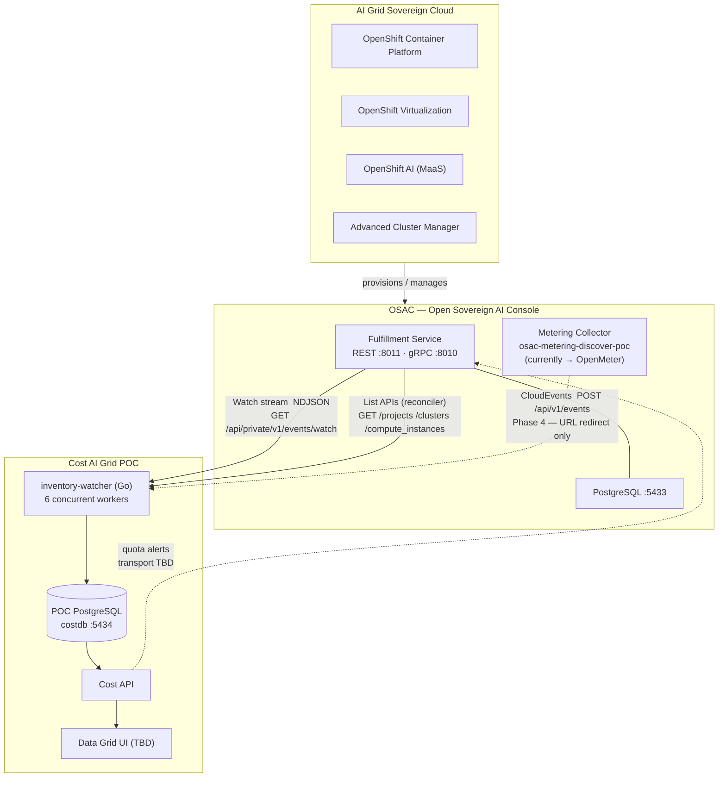
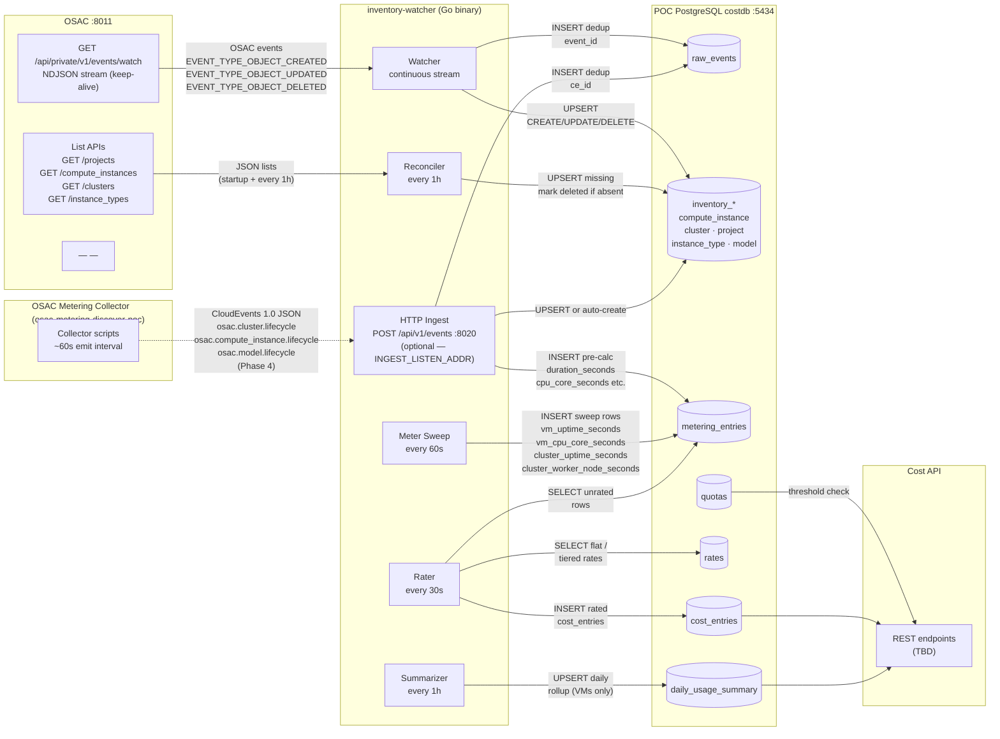
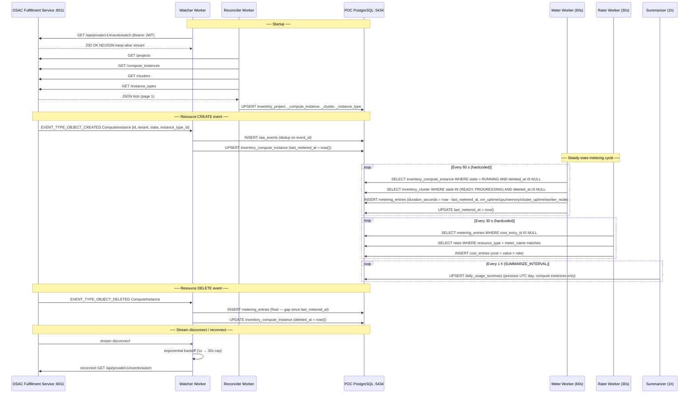
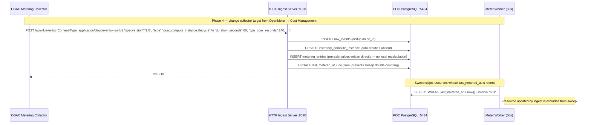
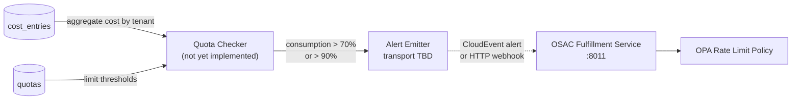
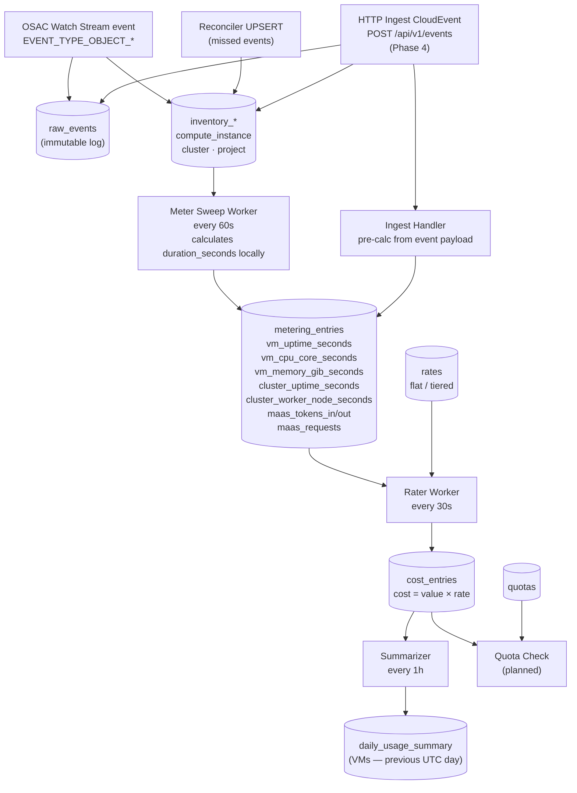
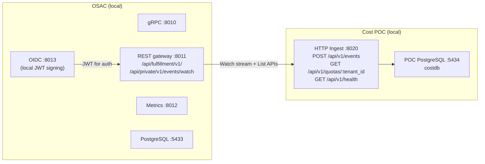

# Cost AI Grid POC — Communications & Architecture Diagram

> **Status:** POC (Proof of Concept)
> **PoC Deadline:** July 31, 2026

This document provides a visual reference for all communications between systems in the AI Grid Cost Management POC. For narrative context see [architecture.md](./architecture.md) and the ADRs in [docs/decisions/](../decisions/).

---

## 1. System Context

High-level view of the three systems and how they relate.

> **Solid arrows** = implemented today. **Dashed arrows** = planned / Phase 4.

---

## 2. Component Communication Detail

Internal breakdown of the `inventory-watcher` workers and every database interaction.

---

## 3. Event Ingestion — Sequence Diagram

Step-by-step communication order from startup through a full metering cycle.

---

## 4. HTTP Ingest Path (Phase 4)

The OSAC metering collector currently sends CloudEvents to OpenMeter. Phase 4 requires only a URL redirect — the `POST /api/v1/events` endpoint already accepts the exact format the collector emits.

**What's done / what's pending:**

| Item | Status |
|---|---|
| `POST /api/v1/events` endpoint | **Done** — accepts `osac.{cluster,compute_instance,model}.lifecycle` |
| Dedup on `ce_id` | **Done** |
| Pre-calculated value ingestion | **Done** — `duration_seconds`, `cpu_core_seconds`, `memory_gib_seconds`, `worker_node_seconds` |
| Sweep double-count prevention | **Done** — `last_metered_at` updated on ingest |
| MaaS (`osac.model.lifecycle`) | **Done** — `inventory_model` + `maas_tokens_in/out/requests` meters |
| Redirect collector target URL | **Pending** — OSAC action only (no Cost code changes needed) |
| Agree on transport & interval | **Pending** — HTTP push favored; interval (10–30s vs 60s) TBD |
| BMaaS CloudEvent schema | **Blocked** — OSAC must define schema first |

---

## 5. Quota Alert Flow

Alert transport back to OSAC is not yet decided. Likely shape once implemented:

See [boundary_monitoring/alerting-osac-integration.md](./boundary_monitoring/alerting-osac-integration.md) and [boundary_monitoring/alerting-spec-draft.md](./boundary_monitoring/alerting-spec-draft.md) for the full design.

---

## 6. Metering Pipeline — Internal Data Flow

How raw events become cost entries.

---

## 7. Local Port Map (Development)

---

## References

- [architecture.md](./architecture.md) — full narrative architecture
- [ADR-001: Metering sweep interval](../decisions/001-metering-sweep-interval.md)
- [ADR-002: Watch stream vs. Kafka](../decisions/002-arguments-against-kafka.md)
- [ADR-003: Heartbeat events vs. local sweep](../decisions/003-heartbeat-emitter-vs-sweep.md)
- [event-types.md](./event-types.md) — CloudEvent schemas
- [metering/metering-spec-draft.md](./metering/metering-spec-draft.md) — capacity metering spec
- [boundary_monitoring/alerting-osac-integration.md](./boundary_monitoring/alerting-osac-integration.md) — quota alert design
