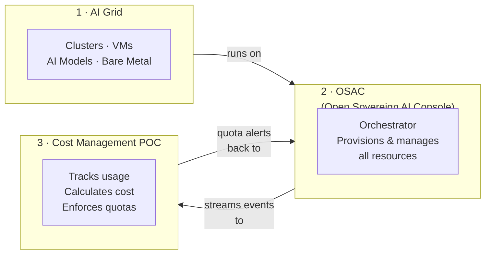
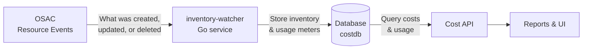
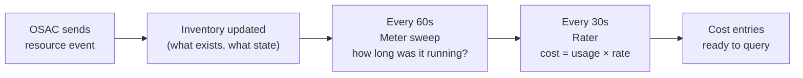
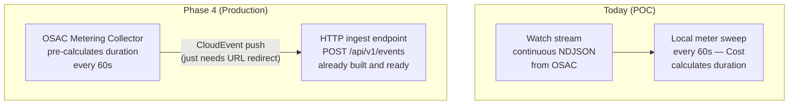
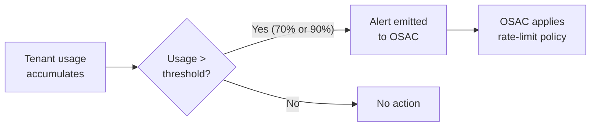

# Cost Management for AI Grid — POC Overview

---

## What Are We Building?

A **Cost Management** system that plugs into the AI Grid sovereign cloud — tracking resource usage, calculating costs, and alerting when tenants approach budget limits.

```
AI Grid  →  OSAC  →  Cost Management  →  Reports & Alerts
```

---

## The Three Systems



---

## How Data Flows (Simple View)



---

## What Gets Tracked

| Resource | Type | How We Meter It |
|---|---|---|
| **Cluster** (OCP) | Capacity | Time cluster is running × node count |
| **VM** (OpenShift Virt) | Capacity | Time VM is running × CPU cores / memory |
| **AI Model** (OpenShift AI) | Consumption | Tokens in + tokens out + requests |
| Bare Metal | — | Not in scope for POC |

---

## The Metering Pipeline



1. **OSAC** tells us when a resource is created, changed, or deleted
2. **inventory-watcher** keeps a live inventory of all resources
3. Every **60 seconds** — calculate how long each resource has been running
4. Every **30 seconds** — apply pricing rates → produce cost rows
5. **Cost API** serves those rows to dashboards and reports

---

## Two Ways Events Arrive



> The POC self-meters today. In production, OSAC pushes pre-calculated usage — the endpoint is already built.

---

## Quota Alerts



---

## POC Scope Summary

| Capability | Status |
|---|---|
| Inventory sync from OSAC watch stream | **Done** |
| Cluster metering (capacity-based) | **Done** |
| VM metering (capacity-based) | **Done** |
| Pricing / cost calculation | **Done** |
| AI Model metering (consumption-based) | **Partial** |
| HTTP ingest endpoint (Phase 4 ready) | **Done** |
| Cost API + Reports | In progress |
| Quota alerts to OSAC | Planned |
| Bare Metal metering | Blocked (OSAC schema TBD) |

---

## What We Need from OSAC (Phase 4)

Only **one action** is required on the OSAC side to move from POC to production metering:

> **Redirect the metering collector's target URL from OpenMeter to the Cost Management endpoint.**

No schema changes. No format translation. The endpoint is built and verified.
